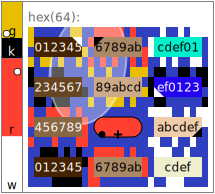

# entviz

**entviz** turns a high-entropy value — a cryptographic key or signature, a
UUID, a blockchain address, a post-quantum key, a genome — into a compact SVG
diagram that an ordinary person with reasonably good vision can compare at a
glance. The goal is simple: let a human decide *"are these two blobs of entropy
the same or different?"* without reading 88 characters of base64 one symbol at
a time.

Every value is rendered across several redundant visual channels — text cells,
a per-cell surround pattern, nucleus colors, a fingerprint-derived color bar,
blank-cell markers, and an ellipse overlay — so that even a single-bit
difference in the input is obvious, and so that color-blind viewers and
monochrome displays still get a reliable signal.

<figure markdown="span">
  { width="320" }
  <figcaption>A 256-bit value rendered as an entviz.</figcaption>
</figure>

## Explore

- **[Specification](spec.md)** — the full algorithm (current: v5): normalization,
  tokenization, the fingerprint, geometry, and every visual channel.
- **[Gallery](gallery.html)** — entvizes across real input types (UUIDs, hex,
  blockchain addresses, SSH keys, ULIDs, LEIs, snowflakes) and avalanche pairs.
- **[Paper](entviz-paper.md)** — the longer-form analysis and design rationale.
- **[Developers (README on GitHub)](https://github.com/dhh1128/entviz#readme)** —
  install with `uv`, run the CLI, run the tests, and cut releases.

A [threat model](threat-model.md) covering the comparison guarantees is also
available.

## At a glance

- Losslessly represents up to 512 bits in the text channel; larger inputs show
  head + fingerprint-selected middle slices + tail, and bind the whole input
  through the fingerprint.
- Amplifies single-bit differences via a SHA-512 fingerprint, even when the
  input itself has no avalanche effect.
- Usable under red-green, blue-yellow, and complete color blindness.
- Trivial to implement, with no significant dependencies.
