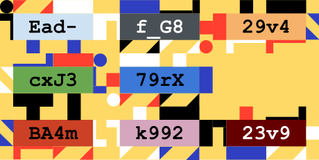
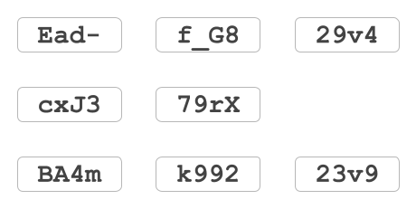
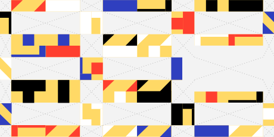
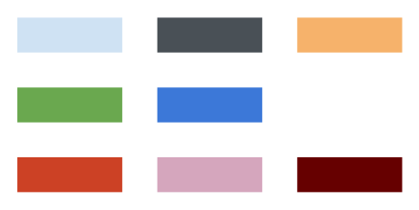
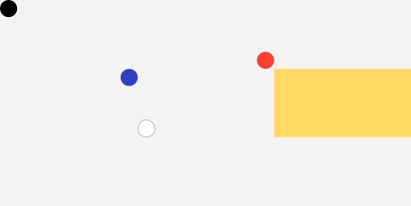
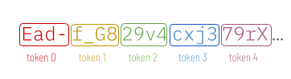
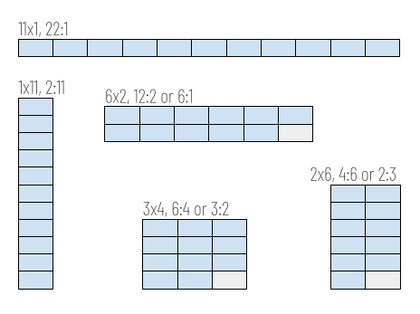
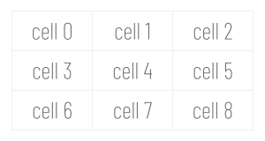
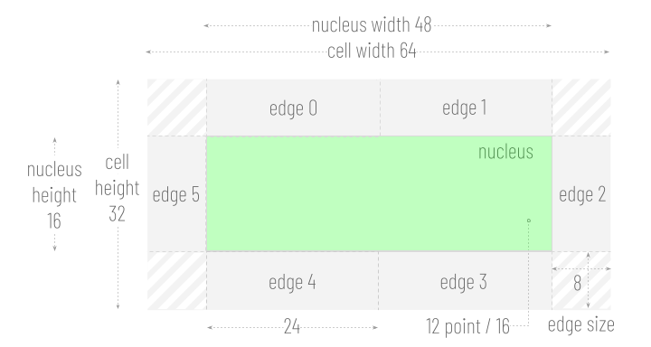
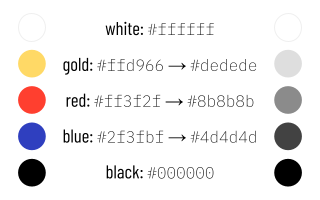

# entviz
Entviz is a simple way to visualize values with high entropy &mdash; cryptographic keys and signatures, UUIDs, blockchain payment addresses, post-quantum keys, genomes, and so forth &mdash; so a human can compare them visually. The goal is to allow an untrained adult with reasonably good vision to easily decide whether two chunks of entropy are the same or different.

**DRAFT — version 4.** The v3 spec is archived at [v3/index.md](v3/index.md). v4 keeps v2's fingerprint, large-input handling, and overall structure, and keeps v3's color bar skew, color bar frame, ellipse overlay rework, and hex font fitting. The substantive v4 changes are concentrated in the edge channel and a couple of geometry/layout choices that follow from it:

* The v3 edge channel — 6 edge rects per cell, each filled with a cubist or polygon shape using a per-edge XOR rotation through a 4-color edge palette — is replaced by a **24-box surround** per cell. Bit *i* of the ftok's quant (LSB = bit 0) controls whether box *i* is filled or empty. The surround tiles the entire region around the nucleus with no corner rects.
* Each cell has a **single edge color** chosen as the palette entry (one of the 4 non-bg colors) perceptually closest to that cell's nucleus background. Per-edge color rotation, `color_shift`, and `shape_shift` are gone.
* **Nucleus geometry** decouples from font size in the vertical direction: `nucleus_width = 3·font_size_px` (unchanged) but `nucleus_height = 1.25·font_size_px` (was equal to font_size_px). The 25% vertical extra makes room for the glyph descenders of monospace fonts whose bounding boxes extend below the em-box (most of them); v3 had this descender-protrusion latent but it was masked by sparsely-filled edge shapes. With v4's densely solid surround, descenders protruding into the surround region became visible.
* **Cell aspect ratio** is therefore 3:2 (not v3's 2:1). cell_width = nucleus_width + 2·box_width = 10·box_width = 3.75·font_size_px; cell_height = nucleus_height + 2·box_height = 4·box_height = 2.5·font_size_px. Surround boxes are no longer square: `box_width = nucleus_width/8 = 0.375·font_size_px` (derived from the horizontal tiling — 10 top-row boxes span nucleus_width + 2·box_width); `box_height = nucleus_height/2 = 0.625·font_size_px` (derived from the vertical tiling — 2 side-column boxes stack to nucleus_height).
* The **shape count summary** (SCS) is removed entirely; there are no shapes left to count. The bounding rect contracts by (nucleus_height + GM) on the bottom.
* The **color bar's data source** changes: v3 tallied per-edge color usage; v4 tallies the four 2-bit patterns (00, 01, 10, 11) across the 256 disjoint 2-bit slices of the SHA-512 digest. The count⁴ skew, descending sort, and rendering geometry are unchanged.
* A small **SVG-portability fix** for the ellipse overlay: the clipPath id is salted with the fingerprint and grid dimensions so that multiple entvizes embedded in the same HTML document do not collide on a shared id (which silently makes the browser resolve every `url(#…)` to the first matching id document-wide).



Compare [entmotif](https://dhh1128.github.io/entmotif), which turns entropy into music. The excellent [randomart](http://www.dirk-loss.de/sshvis/drunken_bishop.pdf) algorithm used with SSH keys is also related; it has a similar goal to entviz, but accepts different constraints and uses a different approach.

## Requirements
* Work in environments that can draw bitmapped or vector graphics.
* Losslessly represent all bits of entropy up to 512 bits. For larger inputs, losslessly represent the first and last 256 bits in the text channel, and bind the entire input through the fingerprint.
* Make it easy to read the entropy value out loud without the reader losing track of where they are.
* Support efficient partial comparisons (spot-checking).
* Guarantee that input entropy with even minor differences produces obvious visual differences, even when the input lacks an avalanche effect of its own.
* Uses 16 million colors (R*256, G*256, B*256). However, guarantee that entropy with even minor differences continues to have obvious visual differences in 256-color environments and in 256 shades of gray.
* Be usable by people with red-green, blue-yellow, and complete color blindness.
* Be trivial to implement correctly, with no significant dependencies.

## Nonrequirements
* Make it easy to remember all the details in a visualization. (Remembering a few arbitrarily chosen features of an entviz should be easy, but remembering all its details is unrealistic. The more appropriate goal is easy comparison to a saved copy.)
* Work in pure text environments. (Few pure text environments exist; even linux shells can save a file for viewing in a browser. Use randomart or invent a variation on this algorithm instead.)

## Concepts
A diagram produced by this algorithm is called an **entviz**. Entvizes can be categorized according to the dimensions of the grid into which they render: a "3x4 entviz", a "5x9 entviz", etc. Dimensions are given in <var>Width</var> x <var>Height</var> order. The maximum expressive **capacity** of an entviz of dimensions NxM is equal to 24 * N * M bits, although slightly less information may be communicated, depending on how the entropy is serialized to text.

The input being visualized is the **entropy**. The entropy is serialized to text and chopped into **tokens**, each of which represents 24 bits of entropy (or as close as possible on even character boundaries). The number of tokens is the **token count**.

The **fingerprint** is the SHA-512 hash of the normalized entropy. Because the fingerprint is produced by a cryptographic hash, it exhibits a strong avalanche effect: a single-bit change anywhere in the entropy changes roughly half the bits of the fingerprint. This is what lets entviz amplify differences even when the entropy itself is chosen rather than generated (for example, a UUID, a raw hex string, or a base64url blob), and what lets entviz handle inputs of any size. The fingerprint is tokenized exactly as the entropy is &mdash; into 24-bit chunks of base64url text. A token of the fingerprint is called an **ftok**. Because SHA-512 is always 512 bits (64 bytes), the fingerprint always yields exactly 22 ftoks: 21 full ftoks of 24 bits each, plus one partial ftok formed from the trailing byte and extended to 24 bits as described below.

Most of the entviz is drawn from the fingerprint rather than from the entropy directly. Specifically, the text of each cell and the background color of each cell's nucleus are derived from the **entropy**, preserving losslessness for inputs of 512 bits or less. Everything else &mdash; the surround-box pattern in each cell, the median and quartile calculations, blank cell placement, the entviz background color, the color bar, and the ellipse overlay &mdash; is derived from the **fingerprint**.

## Guarantees
Each entviz conveys its entropy fully and independently, in a first visual channel, as text. If the text in an entviz is read aloud, *taking into account case-sensitivity*, all information is transferred. Text is tokenized into cells for efficient and reliable reading, and the cells are organized into a grid, which should be read left-to-right and top-to-bottom. For inputs of 512 bits or less, this text channel is fully lossless. For inputs greater than 512 bits, the text channel displays the first 256 bits and the last 256 bits of the entropy, separated by a blank cell; the full input is still bound into the visualization through the fingerprint, which drives all other channels.

The text channel does not, by itself, provide a visual avalanche effect: two inputs that differ by a single character will show nearly identical text. Avalanche is provided by the fingerprint-driven channels. The text channel's role is verbatim fidelity, not difference amplification, and it should be understood as one channel among several rather than a sole comparison method.



Each entviz also conveys its entropy, in a second visual channel, via the **surround** around each cell's nucleus. The surround is composed of 24 small rectangles arranged in a ring (10 above the nucleus, 10 below, 2 on each side). Each box is either filled or empty, controlled by one bit of the cell's ftok quant; the filled boxes use a single per-cell **edge color** chosen as the palette entry perceptually closest to the cell's nucleus background. The result reads as the nucleus color "leaking outward" through a quant-controlled pixel pattern.



The edge color is chosen from a fixed 4-color palette (the 4 non-background entries of [white, gold, red, blue, black]). The palette is intentionally simple, and perceptual selection ensures that even color-blind viewers can detect each cell as a separate object distinct from the background.

Each entviz conveys its entropy, in a third visual channel, via the color that provides the background for the text in each cell. This nucleus background color is derived from the entropy, so for inputs of 512 bits or less it remains lossless. However, fine gradations in the colors of the nucleus may not be perceptible to the human eye, and these gradations will disappear if less than 16 million colors are displayable. Therefore, the colors in the nucleus are a partially redundant hint; they will never be misleading, but they should not be a primary comparison method.



Zero or more cells in an entviz may be blank. The positioning of blank cells derives from the fingerprint. An entviz also contains small *quartile* marks on four cells. Blank cells and quartile marks are easily checked by viewers, and act as a sort of visual CRC. They surface differences that may be otherwise hidden in the middle of long strings and at the end of individual tokens.



Each entviz displays a **color bar** along its left edge. It is derived from the fingerprint and provides a redundant channel that allows rapid gestalt comparison: two entvizes with different 2-bit-pattern histograms will differ visibly in the bar even before a cell-by-cell comparison begins.

Each entviz that has at least 256 bits of input entropy also displays a partially transparent **ellipse overlay** derived from the fingerprint. The ellipse is anchored at a corner *interior* to the grid (a cell-corner that is not on the grid's outer boundary), sized to produce a visibly curved arc clipped within the grid, and it darkens or lightens the surround boxes and grid background beneath it without affecting the nuclei or text. This creates a large, organic shape that contributes to the overall gestalt identity of the entviz and makes a quick, high-level glance more informative. Inputs smaller than 256 bits omit the overlay entirely; their grids are too small for the curve to be readable.

## Thoughts About Comparing

*Note: when reading entviz text aloud, the convention is to precede each capital letter with the one-syllable prefix "cap", to read the hyphen character `-` as "dash", and to read the underscore character `_` as "under". This minimizes the number of syllables while eliminating all ambiguity.*

* display a 2-bit pattern histogram for the fingerprint as a redundant comparison aid
* allow toggling off each channel, each color, CRC
* spotcheck by reading a row or column or by having a column / row slider
* render with a legend for rows and columns

## Entviz Algorithm
1. Normalize the input.
    * Remove all whitespace.
    * Detect the entropy type, if possible, and split the input into prefix, core, and suffix, with all three pieces of data normalized. This should eliminate case differences, putting the entropy in canonical case, with canonical punctuation. It should identify prefixes that are not true entropy (e.g., the "0x" prefix on an Ethereum address, the "AAAA" at the front of an SSH key, etc.). It should identify suffixes that are checksums or derivations of the true entropy. The reference implementation in python has an `entropy` module with a `parse(txt)` method that can be used as an oracle, and it has unit tests that can provide a test vector.
    * If no specific-format parser matches, attempt **alphabet detection by disproof**: iterate through the known alphabets from most-restrictive to least and return the first one whose character set contains every character of the input. The order is: `hex` → `base32` → `bech32` → `base58` → `base64` → `base64url`. Hex/base32/bech32 detection is case-insensitive; base58/base64/base64url are case-sensitive (they treat upper and lower case as distinct characters). A successful disproof match treats the input itself as the normalized core under the detected alphabet (no re-encoding).
    * If even disproof finds no fit (e.g., the input contains a space, punctuation, or other unencodable characters), fall back to treating the input as an arbitrary bag of bits: encode the input string to UTF-8 bytes, then re-render those bytes as a URL-safe base64 string (no padding). The resulting base64 string is treated as the normalized core; the type is `base64`. UTF-8 is the canonical byte encoding for the fallback path; implementations MUST NOT use other encodings (Latin-1, UTF-16, etc.) because that would change the fingerprint of identical-looking inputs.

1. Compute the **fingerprint** as the SHA-512 hash of the normalized entropy bytes. Serialize the 64-byte fingerprint to base64url text and split it into **ftoks** using exactly the same tokenization rule applied to the entropy: each ftok represents 3 bytes (24 bits) of the fingerprint. This yields 21 full ftoks plus one partial ftok formed from the trailing byte; extend the partial ftok to 24 bits by repeating its low-order bits, exactly as for a partial token. The fingerprint therefore always provides 22 ftoks. Assign each ftok an **ftok index** between 0 and 21, inclusive. The fingerprint is never displayed as text.

1. Split the entropy string into tokens. Each token represents 3 bytes (24 bits) of binary entropy, or as close to that amount as possible while respecting whole-character boundaries of the underlying encoding. The **token length** (chars per token) is determined by the **alphabet** the parser declared for the input — not by inspecting the content of the core or by string-matching the type name. (Content inspection is unsound: a base32 value, for instance, can use only characters from the hex alphabet and would be indistinguishable from hex on inspection. Each parser knows which alphabet its core uses and must declare it.) The alphabets in this spec are:

    * **hex** (4 bits per char): token length = 6 characters (= 24 bits). Used by raw hex inputs, hex multihash, UUID, and Ethereum addresses.
    * **base58** (6 bits per char in this spec's tokenization; note that base58's *true* information density is ~5.86 bits/char, but this spec treats base58 chars as 6-bit values for tokenization purposes, matching the reference implementation): token length = 4 characters (= 24 bits). Used by Bitcoin legacy, Ripple, Litecoin legacy, Cardano Byron, and IPFS CID v0.
    * **base36** (6 bits per char for token alignment, matching the same convention base58 uses; true information density is ~5.17 bits/char): token length = 4 characters (= 24 bits). The alphabet is `0123456789ABCDEFGHIJKLMNOPQRSTUVWXYZ`. Used by GLEIF LEIs (ISO 17442; 20 chars total = 5 tokens; structure is 4-char LOU + `00` reserved + 12-char entity body + 2-char MOD 97-10 checksum).
    * **base64** and **base64url** (6 bits per char): token length = 4 characters (= 24 bits). Used by CESR, SSH keys, EOS addresses, DIDs, and the unknown-input fallback (the input is re-encoded as base64url before tokenization).
    * **bech32** (5 bits per char per BIP-173): token length = 4 characters (= 20 bits, then extended to 24 by the bit-extension rule). The alphabet is `qpzry9x8gf2tvdw0s3jn54khce6mua7l`, which intentionally excludes `1`, `b`, `i`, `o` to reduce ambiguity (and `1` doubles as the bech32 separator). 4 chars per token is chosen over the alternate 5-chars-per-token (= 25 bits) because the quant is defined as a 24-bit value; a 25-bit token would overshoot the budget. Used by Bitcoin SegWit (`bc1...` / `tb1...`), Litecoin (`ltc1...`), Cardano Shelley (`addr1...` / `stake1...`), and Bitcoin Cash CashAddr (which is commonly called "base32" but actually uses the bech32 character set).
    * **base32** (5 bits per char per RFC 4648): same 4-chars-per-token tokenization as bech32, but with a different character set: `ABCDEFGHIJKLMNOPQRSTUVWXYZ234567`. Excludes `0/1/8/9` (and is conventionally case-insensitive with most uses being all-uppercase). Used by Stellar (`G...`) and IPFS CID v1 (`b...`).
    * **crockford32** (5 bits per char): same 4-chars-per-token tokenization as bech32 and base32 (= 20 bits per token, extended to 24 by the bit-extension rule). The canonical alphabet is `0123456789ABCDEFGHJKMNPQRSTVWXYZ` — excludes `I`, `L`, `O`, `U` for visual disambiguation. The spec also accepts `I`, `L` (→ `1`) and `O` (→ `0`) as case-insensitive input aliases; `U` is not an alias and remains forbidden. Used by ULIDs (26 chars total).

    The general rule is: token length = `floor(24 / bits_per_char)`. For bits_per_char ∈ {4, 6} this divides evenly (6 chars and 4 chars respectively); for bits_per_char = 5 it gives 4 chars (= 20 bits) which then extend to 24 via the rule below. Call the number of tokens the **token count**. Assign to each token a **token index** between 0 and *token count* - 1, inclusive. If the entropy is greater than 512 bits, do not tokenize the whole input; instead tokenize only the first 256 bits and the last 256 bits of the entropy, and treat the two groups as separated by a single blank cell. In all cases, *token count* will be at most 22.

    

    Also, if a token represents less than 24 bits of entropy, extend the bits of the token by repeating low-order bits until a full 24 bits is used. Call the 24-bit value associated with the token its **quant**.

    Specifically, given an integer value `v` with `actual_bits` bits of information (where `0 < actual_bits < 24`), the extension proceeds by repeated doubling of the current value, taking each pad chunk from the low-order bits of the *current* (already extended) value:

    ```
    quant = v
    while actual_bits < 24:
        shift = min(actual_bits, 24 - actual_bits)
        pad = quant & ((1 << shift) - 1)        # low-order `shift` bits of quant
        quant = (quant << shift) | pad
        actual_bits += shift
    ```

    Worked examples:

    * 8-bit value `0xAB` (binary `10101011`): iteration 1 (`shift=8`) → `0xABAB`; iteration 2 (`shift=8`) → `0xABABAB`. Final quant: `0xABABAB`.
    * 4-bit value `0x5` (binary `0101`): iteration 1 (`shift=4`) → `0x55`; iteration 2 (`shift=8`) → `0x5555`; iteration 3 (`shift=8`) → `0x555555`. Final quant: `0x555555`.
    * 12-bit value `0xABC`: iteration 1 (`shift=12`) → `0xABCABC`. Final quant: `0xABCABC` (one iteration suffices when `actual_bits` doubles cleanly to 24).

    The shift size at each step is `min(actual_bits, 24 - actual_bits)`, so the algorithm terminates in at most a few iterations regardless of the starting size.

1. The complete entropy is visualized as a rectangular **grid** consisting of a certain number of **cells**. Call this number of cells the **cell count**. Each token is rendered into one cell in the grid, and if the rectangle of the grid has more cells than *token count*, one or more cells will be empty.

    Grids of a single row or a single column are invalid: the minimum grid is 2 columns by 2 rows. Each cell touches its neighbors directly and has an aspect ratio of **3:2** (= `cell_width` : `cell_height` = `3.75·font_size_px` : `2.5·font_size_px`). Given a **target aspect ratio** for the entviz (or, if none is given, using 1:1 as the target), choose the grid layout that produces an overall rectangle with an aspect ratio closest to the target, without being less than the target when the ratios are written as fractions, and with at least 2 columns and 2 rows.

    >Using more entropy than the example we've been building, just to show how this works in more complicated situations: 256 bits of entropy is 44 base-64 characters or 11 tokens. 11 tokens can be rendered as a grid with 6 columns and 2 rows (rounding *token count* to 12; aspect ratio (6·3):(2·2) = 18:4 = 9:2), 4 columns and 3 rows (12:6 = 2:1), 3 columns and 4 rows (9:8), or 2 columns and 6 rows (6:12 = 1:2). Given a *target aspect ratio* of 1:1, the grid layout with an aspect ratio closest to 1:1 but not less than 1:1 is the one with 3 columns and 4 rows.

    

1. Moving from left to right and top to bottom &mdash; which is how ASCII text should read if it wraps &mdash; number the cells from 0 to N, and call the number associated with each cell its **cell index**. Assign a *cell index* to each token. Unless changed, the *cell index* of a token will equal its *token index*.

    

1. Define the **used ftoks** as the first *token count* ftoks of the fingerprint, taken in ftok index order. The used ftoks map one-to-one to tokens: the used ftok at index *i* corresponds to the token with *token index* *i*. (Because *token count* is at most 22 and the fingerprint provides 22 ftoks, there are always enough.) Any ftoks beyond *token count* are not used. From here on, all fingerprint-based calculations operate on the used ftoks. The 24-bit value of an ftok is its **quant**, defined exactly as for a token.

1. Sort the used ftoks in **ASCII order** &mdash; case-sensitive bytewise (lexicographic) comparison of the ftok's base64url text. Since base64url characters are all in the ASCII range, this is equivalent to UTF-8 bytewise comparison. Shorter strings sort before longer strings that share their full content as a prefix (standard lexicographic ordering; partial ftoks therefore sort below full ftoks that begin with the same chars). Use a secondary sort by *ftok index*, in case the same ftok appears in more than one place. Identify the first ftok in the sorted list that contains the median value. (If the count is even, use the first ftok from the middle pair.) Call this the **median ftok**.

1. Also sort the used ftoks by the ASCII order of their mirror image (with a secondary sort on the ftok index, in case the same ftok appears in more than one place). For example, if an ftok is "a4W6", its sort key would be "6W4a". If the number of used ftoks is not evenly divisible by 4, act as if 4 - (*token count* mod 4) blank items existed at the bottom of the list. Now divide the sorted list into 4 sections and call each section a **quartile**. Identify the first ftok in each quartile and call it the **first quartile ftok**, the **second quartile ftok**, and so on.

1. If *token count* is less than *cell count*, the grid will have blank cells. We want to use blank cells to create visual gaps in a consistent way that is more meaningful than simply putting all the blanks at the beginning or end, because this will aid comparison. Each used ftok corresponds to a token (and therefore to a cell); use that correspondence to locate the cells named below. Insert a blank cell at the *cell index* of the token corresponding to the *median ftok* by incrementing the *cell index* of all tokens whose *token index* >= that token's *token index*. This essentially shifts these tokens to the right or down in the grid. If *token count* + 1 is still less than *cell count*, insert a second blank cell before the cell of the last ftok in the ASCII-sorted list, again shifting cells that render after. If *token count* + 2 is still less than *cell count*, insert a third blank cell before the cell of the first ftok in the ASCII-sorted list, again shifting cells that render after. Do not perform more than 3 shifts. (For inputs greater than 512 bits, the blank cell separating the first and last 256-bit groups is in addition to these.)

1. Choose a fixed-width font such as Courier, and an appropriate font size for reading. In our example, we will use 12 point, but the algorithm will work at any reasonable font size. The size of the font determines the scale of the entviz.

1. Convert the point size of the font into pixels and call this value **font_size_px**. Use the formula: `pixels = (points · DPI) / 72`. Most devices use 96 DPI, although other values are possible. At 96 DPI, a 12-point font = 16 pixels. This is the em-size of the font; the actual glyph bounding box (ascender top to descender bottom) is typically slightly larger, which the cell geometry below accounts for.

    The chosen point size is called the **reference font size**. Throughout this spec, all geometry — nucleus dimensions, cell dimensions, grid dimensions, box dimensions, GM, bounding rect, color bar width — is derived from `font_size_px`. The reference is independent of the size actually applied to any specific piece of rendered text; some text elements are drawn at a smaller **rendered font size** (see the cell rendering algorithm below). The rendered font size never affects geometry.

1. Compute the geometry, all anchored on `font_size_px`:

    * **nucleus width** = `3·font_size_px` (so the nucleus is wide enough to hold 4 monospace glyphs at full reference size with horizontal margin)
    * **nucleus height** = `1.25·font_size_px` (the 25% vertical extra accommodates the glyph descenders of typical monospace fonts, whose bounding box extends below the em-box by ~20–25%)
    * **box width** = `nucleus_width / 8` = `0.375·font_size_px`. Derived from the horizontal tiling: 10 top-row boxes span `nucleus_width + 2·box_width`, so `10·box_width = nucleus_width + 2·box_width`, i.e. `8·box_width = nucleus_width`.
    * **box height** = `nucleus_height / 2` = `0.625·font_size_px`. Derived from the vertical tiling: 2 side-column boxes stack to `nucleus_height`.
    * **cell height** = `nucleus_height + 2·box_height` = `4·box_height` = `2.5·font_size_px`
    * **cell width** = `nucleus_width + 2·box_width` = `10·box_width` = `3.75·font_size_px`. Cell aspect is 3:2.
    * **grid width** = `cell_width · cols`
    * **grid height** = `cell_height · rows`
    * **GM** (grid margin) = `box_height / 2`

    At 96 DPI with a 12-point font: `font_size_px` = 16, `nucleus_width` = 48, `nucleus_height` = 20, `box_width` = 6, `box_height` = 10, `cell_width` = 60, `cell_height` = 40, GM = 5. Surround boxes are 6×10 (no longer square); the 3:5 width:height ratio of a box is *not* a fundamental constant — both dimensions are derived independently from their tiling constraints. If a future revision changes `nucleus_height` or `nucleus_width` independently, the box dimensions follow.

    

1. Allocate the **grid rect**, a rectangle of dimensions *grid width* x *grid height* that contains only the cells of the grid. We will assume that the top left corner of the *grid rect* is at position (0, 0) on the canvas for the purpose of the cell calculations, but its actual position is determined by the bounding rect below.

1. Allocate the **bounding rect**, the outermost rectangle of the entviz. It contains the *color bar* at its left, the *grid rect*, and the **label strips** (see the label-strip step below). Its dimensions are:

    * width = `1 + box_height + 1 + GM + grid_width + GM + 1`
    * height = `1 + GM + top_label_height + GM + grid_height + GM + bottom_label_height + GM + 1`

    where `top_label_height = nucleus_height` (always present) and `bottom_label_height = nucleus_height` when the parsed result has a suffix, else `0` and the adjacent `GM` margin collapses (so the height reduces to `1 + GM + nucleus_height + GM + grid_height + GM + 1` when no bottom strip is needed). Read the width left to right: a 1-pixel gray left border; then the *color bar* (width = *box height* = 2·GM); then a 1-pixel gray interior separator between the color bar and the grid area; then a GM margin; then the *grid rect*; then a GM margin; then a 1-pixel gray right border. Read the height top to bottom: a 1-pixel gray top border; then a GM margin; then the top label strip; then a GM margin; then the *grid rect*; then a GM margin; then (if present) the bottom label strip; then a GM margin; then a 1-pixel gray bottom border.

    Fill the bounding rect with white. Draw a 1-pixel #808080 line along all four edges of the bounding rect, and a 1-pixel #808080 line down the column between the color bar and the grid area (forming the color bar's right edge). Each border line is centered on a half-pixel coordinate (e.g., x = 0.5 for the left border, x = *bounding_width* − 0.5 for the right border, x = `1 + box_height + 0.5` for the interior separator) and rendered with `shape-rendering="crispEdges"` so a 1-px stroke covers exactly one pixel column or row without antialiasing halos; the four outer lines extend the full canvas width or height so the corner pixels are painted by both adjacent borders. Soft gray rather than pure black avoids visual competition with the black edge color in the palette. The color bar is the inset rectangle bounded on its left by the bounding rect's left gray border and on its right by the interior separator; its drawing region runs from y = 1 (just below the top gray border) to y = `bounding_height − 1` (just above the bottom gray border). Position the *grid rect* with its top-left corner at (`1 + box_height + 1 + GM`, `1 + GM + top_label_height + GM`) within the bounding rect.

    Use the *grid rect* as a clipping region for the ellipse overlay (see below). The color bar and gray border lines are drawn outside the grid rect and need no clipping. Draw all clipped content first; draw the gray border lines last so the borders are never overwritten.

1. Let the array of **possible edge colors** be `[white #ffffff, gold #ffd966, red #ff3f2f, blue #2f3fbf, black #000000]`. The first four entries (indices 0-3) are the **background candidates**; black at index 4 is *always* an edge color and is never selected as the entviz background. This is intentional: black is too visually heavy to serve as a background.

    

    Select the 2 low-order bits of the *quant* of the *median ftok*. Use this 2-bit number as an index into the background-candidates portion of the array (indices 0-3) to select the **entviz background color**. For example, if the 2-bit number == 1, the background color is gold. Remove the selected color from the full *possible edge colors* array to generate a new array consisting of the 4 remaining colors, and call this the **edge palette**. Black is therefore always present in the *edge palette* regardless of which background was chosen.

1. Inside the *grid rect*, render each token T into its appropriate cell in the grid, using its corresponding used ftok and the *edge palette*, according to the [cell rendering algorithm](#cell-rendering-algorithm) below.

1. Draw a **quartile mark** on each *quartile ftok*'s corresponding cell. The mark is a small right triangle in one corner of the *nucleus rect*: both legs are `nucleus_height / 2` long, the right-angle vertex sits at the matching nucleus corner, and the legs run along the two nucleus edges meeting there. The clockwise corner assignment is: 1st = top-left, 2nd = top-right, 3rd = bottom-right, 4th = bottom-left. Quartile identity is carried by triangle *orientation* alone — there is no per-quartile color palette.

    The triangle is filled in the **cell text foreground color** (`#ffffff` or `#000000`, picked by luminance contrast against the nucleus background — the same rule that picks the text color). The mark therefore reads as a small same-color flag in the nucleus corner without obscuring the cell text or requiring any compositing modes. Drawn after the nucleus rect and after the cell text.

1. Draw the **color bar** in the inset rectangle described in the bounding-rect section above (left border at x = 1, right border at `x = 1 + box_height`, drawing height = `bounding_rect.height − 2`). Build a 4-element histogram by counting how many of the 256 disjoint 2-bit slices of the SHA-512 digest (64 bytes × 4 slices/byte = 256 slices) equal each of the four 2-bit patterns (00, 01, 10, 11). Map binary value *i* to *edge palette*[*i*]. For each palette color whose count is greater than zero, compute `count^4`. Divide the color bar's drawing height into horizontal bands, one per nonzero color, with each band's height proportional to that color's `count^4` value as a share of the sum of all four `count^4` values. The fourth-power skew amplifies the dominance of the most-frequent pattern so the bar reads as a clear pecking order rather than four near-equal stripes (which is what a raw-count distribution from a uniformly-random digest typically produces). Order the bands by descending count, most frequent at the top; break ties by the order of the color in the *edge palette*. Fill each band with its color. Total count is always 256 regardless of grid size, so band proportions stay comparable across small and large inputs.

1. Draw the **ellipse overlay**. v4 always draws an overlay (no input-size skip rule): the *anchor* enumeration is chosen *hybrid* based on grid size. Derive the overlay's parameters from fingerprint bytes (the 64 bytes of the raw SHA-512 digest, numbered 0 to 63):

    * **anchor (hybrid)**: count the grid's **interior corners** — cell-corner points strictly inside the grid_rect, of which there are `(N − 1) × (M − 1)` for an N-col × M-row grid.
      * If interior count ≥ 6 (i.e., grid is 3x4 / 4x3 or larger), enumerate the **interior corners** in row-major order; this produces a centered ellipse mostly visible inside the grid.
      * If interior count < 6 (i.e., 2x2, 2x3, 2x4, 2x5, 2x6, 3x3), enumerate the **external corners** — every cell-corner on the grid_rect's outer boundary, which numbers `2(N + M)` per grid. Enumerated in row-major order: top edge left-to-right (N+1 points), then each interior row's leftmost and rightmost corners (2 each), then bottom edge left-to-right (N+1 points). External anchors produce a quarter-ellipse-in-a-corner or half-ellipse-along-an-edge silhouette as most of the ellipse is clipped outside the grid.

      Use fingerprint byte 60, taken modulo the number of anchor points in the chosen list, to select the anchor. The anchor is the *center* of the ellipse, not a point on its boundary.
    * **rx (horizontal semi-axis)**: compute `rx_step = digest[61] mod 16`. Then `rx = r_min + (rx_step / 15) × (r_max − r_min)`, where `r_min = nucleus_height` (= cell_height / 2) and `r_max = d_far − cell_width`. `d_far` is the distance from the chosen anchor to the farthest of the grid rect's four outer corners. The lower bound prevents the curve from being too small to read; the upper bound prevents it from being so large that the visible arc looks flat (the v2 failure mode).
    * **ry (vertical semi-axis)**: compute `ry_step = digest[62] mod 16`. Then `ry = r_min + (ry_step / 15) × (r_max − r_min)`, with the same `r_min` and `r_max` as rx. `rx` and `ry` are drawn independently, so the ellipse ranges from a near-circle to a strongly elongated shape.
    * **rotation**: compute `rotation_step = digest[63] mod 16`. Then `rotation = (rotation_step / 15) × 180°`. Rotates the ellipse around the anchor.
    * **fill and opacity**: chosen per *entviz background color*, since the four background candidates each need different treatment to produce a perceptible silhouette:

        | bg color | hex | overlay fill | opacity |
        |---|---|---|---|
        | white | `#ffffff` | `#000000` (darken) | 20% |
        | gold  | `#ffd966` | `#000000` (darken) | 30% |
        | red   | `#ff3f2f` | `#000000` (darken)  | 40% |
        | blue  | `#2f3fbf` | `#ffffff` (lighten) | 40% |

        Saturated bgs need higher opacity to read against the surround boxes; white is least demanding because its darkened overlay is high luminance contrast against the bg already. Blue darkens to near-black, so it's lightened instead. Red lightens into a chalky pink that loses its character, so it stays darkened. No entropy bytes are consumed for fill or opacity. The v4 opacity values (20/30/40/40) were tuned against the hybrid-anchored small-grid overlays, where the visible silhouette is smaller and needs more pop than v3's centered curves did.

    16 discrete steps per parameter is intentional: it's near the just-noticeable-difference threshold for both pixel-level radius changes and degree-level rotations, so adjacent steps produce overlays that are visibly distinct from each other.

    **Clip the overlay to the grid rect**, not the bounding rect. The overlay must never appear outside the cells of the grid (it must not leak into the margins or color bar). The clipping is what makes external-anchored ellipses (small grids) visible as quarter/half silhouettes — the portion of the ellipse outside grid_rect is clipped away.

    Draw the overlay above the surround-box layer but below the nucleus layer, so that nucleus background colors and text are never affected by it.

    **SVG implementation notes.**

    *Clip-path id uniqueness.* The clipPath element used to confine the overlay must have an `id` that is unique within the enclosing HTML document, not merely unique within its own SVG. When multiple entvizes are embedded in one HTML page (e.g. a gallery), the browser resolves every `url(#…)` reference to the *first* matching id document-wide; if two entvizes both use `id="grid-clip"`, every entviz after the first is silently clipped to the first entviz's grid rectangle. Salt the id with something stable but per-entviz — the reference implementation uses `grid-clip-{first_8_hex_of_fingerprint}-{cols}x{rows}`.

    *Clip-path with rotated content.* When emitting the overlay as an `<ellipse>` carrying a `transform="rotate(…)"`, the `clip-path` attribute must live on a non-rotated parent `<g>` element, not on the ellipse itself. If both attributes go on the same element, SVG resolves the clipPath in the element's post-transform coordinate system — i.e., the clip rectangle rotates along with the ellipse. The two-element structure keeps the clip axis-aligned in screen space while the ellipse rotates within it.

1. Draw the **label strips**. These are thin monospace text bands above (always) and below (only when needed) the *grid rect*. They identify the entropy type, surface any non-entropy prefix/suffix that the parser stripped from the input, and signal large-input truncation. Strips are drawn after cell content but before the final gray border lines, so they sit on top of any underlying fill but never obscure the bounding rect's gray rim.

    **Geometry.** Both strips have height `nucleus_height`. The top strip occupies the band between `y = 1 + GM` (just below the top gray border, after one GM margin) and `y = 1 + GM + nucleus_height`. The grid_rect sits one further GM below that. The bottom strip — present only when the parsed result has a suffix — sits a GM below the grid_rect, again with height `nucleus_height`. Strip widths match `grid_width` and are aligned horizontally with the grid_rect.

    **Text style.** Monospace, `fill = #666666`, font size = the **hex-equivalent rendered size** = `round(font_size_pt × 0.75)` px at 96 dpi (= 12 px at the 12 pt reference). The strip font size is fixed at this value regardless of whether the cell text in this entviz uses full-size (4-char tokens) or shrunk (6-char hex) glyphs — the strip's job is to label the visualization, not match its body type. Top-strip text is left-aligned to `grid_rect.left`; bottom-strip text is right-aligned to `grid_rect.right`, so the ellipses on the two strips point inward toward the grid.

    **Top label content.** `"<Type>:"` if the parsed result has no prefix, else `"<Type>: <prefix>..."`. The trailing `...` is a visual continuation marker into the grid. Examples: `UUID:`, `ETH: 0x...`, `LEI: 549300...`, `base32:`, `hex(40):`, `b64(12):`, `txt(11)->b64url:`.

    * **Variable-length plain-alphabet types embed a parenthesized character count of the body** (not the input, except for the UTF-8 fallback where the count is the original input's byte length). Types using this form: `hex(N)`, `b64(N)`, `b64url(N)`, `txt(N)->b64url`. `base64` and `base64url` are shortened to `b64` and `b64url` to keep labels narrow.
    * **Blockchain types use ticker symbols, not full names**, again to keep labels narrow: Bitcoin → `BTC`, Ethereum → `ETH`, Bitcoin Cash → `BCH`, Litecoin → `LTC`, Cardano → `ADA`, Ripple → `XRP`, Stellar → `XLM`. `EOS`, `UUID`, `ULID`, `LEI`, `SSH` remain as-is (already short).

    **Bottom label content.** `"...<suffix>"`, present only when the parsed result has a suffix. Examples: `...d4af` (Bitcoin legacy 4-char base58 checksum), `...12` (LEI 2-char MOD 97-10 check), `...user@host` (SSH key comment).

    **Large-input truncation marker.** When the input exceeds 512 bits and the text channel is reduced to head-256 + tail-256 (with the inserted separator blank between them), the top label is prefixed with `^…$ ` — regex start anchor + ellipsis + end anchor — to signal in a language-neutral way that the cells display only the first and last fragments of the input. Example: `^…$ hex(200):`. The fingerprint-driven channels still cover the entire input, so the strip serves as a clear visual warning that the text channel alone is not lossless for this entviz.

## Cell Rendering Algorithm

A cell is rendered from a token T and the used ftok F that corresponds to it. The token supplies the cell's text and nucleus background color; the ftok supplies the surround pattern.

1. For a given token T, identify the **origin point** within the *grid rect* with coordinates *x*, *y* with the following formulas: *x* = (*T.cell index* mod *column count*) * *cell width*; *y* = int(*T.cell index* / *column count*) * *cell height*.

1. Convert the *quant* for T into an RGB value the same way CSS does it &mdash; red in the low-order byte, and so forth &mdash; and call this RGB value the **nucleus background color**. The **foreground color** is white (#ffffff) or black (#000000), picked by the **Oklab perceptual lightness** `L` of the bg: if `L < 0.6`, use white; otherwise use black. `L` is computed via the Oklab transform (Björn Ottosson, 2020) — sRGB → linear-light → LMS → cube-root → `L`. See the reference implementation (`entviz/colors.py::oklab_lightness`) for the exact coefficients.

    WCAG relative luminance `Y` over-weights green (`0.7152·G`), so saturated dark greens like `#55841c` land at `Y = 0.185` — just past the WCAG-AA equal-contrast crossover at `Y ≈ 0.179` and thus pair with black, even though the eye reads them as dark and expects white text. Oklab places the same color at `L = 0.559`, much closer to the perceptual midpoint. The threshold sits at `0.6` rather than the rigorous Oklab midpoint of `0.5` because small dark glyphs on mid-gray fields read less crisply than small light glyphs of the same lightness gap — the +0.1 bias flips dark-green-class colors (`L ≈ 0.54–0.59`) to white where they read better.

    The naive `Y < 0.5` rule used in v3 was the original wrong approach: it mis-paired medium-luminance backgrounds (e.g., light beige `#c3b2a1` at `Y ≈ 0.47`) with white, producing WCAG ratios of 2-3:1 that fail AA. The WCAG `Y ≈ 0.179` crossover always yields the higher-contrast pairing in luminance terms, but as noted above, perceptual lightness is a better predictor of how small glyphs actually read.

1. Determine this cell's **edge color** as the entry of the *edge palette* (the 4 non-bg colors) with the minimum **weighted RGB distance** to the *nucleus background color*. The distance metric is:

    ```
    d(c1, c2) = sqrt( 2·(r1−r2)² + 4·(g1−g2)² + 3·(b1−b2)² )
    ```

    Green is weighted highest because cone-peak sensitivity in the human visual system is in the green range; blue is weighted lowest. This formula is a cheap stand-in for CIELAB ΔE; implementations MAY substitute true CIELAB ΔE if they prefer, with the understanding that the choice of palette entry per cell may differ on borderline cases.

1. **Surround layout.** Inside the cell, divide the region around the nucleus into 24 **surround boxes**. Every box is `box_width × box_height` (= `0.75·box_height × box_height` = `6 × 8` at 12pt). The 24 boxes are arranged:

    * **Top row** (10 boxes): each box at `y = nucleus.top − box_height`. Box *i* (for *i* in 0..9) starts at `x = nucleus.left − box_width + i·box_width`. The row spans `x = nucleus.left − box_width` to `x = nucleus.right + box_width` (= nucleus_width + 2·box_width = 10·box_width exactly).
    * **Right column** (2 boxes): each box at `x = nucleus.right`. Box at index 10 starts at `y = nucleus.top`; box at index 11 starts at `y = nucleus.top + box_height`. The two boxes together span the full nucleus height (`2·box_height = nucleus_height`).
    * **Bottom row** (10 boxes): each box at `y = nucleus.bottom`. Box at index 12 starts at `x = nucleus.left − box_width + 9·box_width`, and successive indices step *left* by `box_width`, so box 21 is at the same `x` as the leftmost top-row box.
    * **Left column** (2 boxes): each box at `x = nucleus.left − box_width`. Box at index 22 starts at `y = nucleus.top + box_height`; box at index 23 starts at `y = nucleus.top`.

    Box indices 0..23 are numbered clockwise from the top-left of the top row. There are **no corner rects** — the top and bottom rows extend past the nucleus's left and right edges to cover what would otherwise be corner regions, and the surround tiles the cell's full perimeter flush with cell boundaries.

1. **Surround fill.** For each *i* in 0..23: if bit *i* of the ftok quant (LSB = bit 0) is 1, fill box *i* with the cell's *edge color*. If the bit is 0, draw nothing for box *i*.

1. Draw a **nucleus rect**. Dimensions are *nucleus width* x *nucleus height*. Top left corner is at `x + box_width`, `y + box_height`. Fill color = *nucleus background color*. The nucleus is drawn *after* the surround boxes (and after the ellipse overlay), so the overlay never tints the nucleus.

1. Determine the **cell text rendered font size** based on the token character count:

    * If the token is 4 characters (base64, base58): rendered font size = the reference font size.
    * If the token is 6 characters (hex): rendered font size = `round(0.75 × reference_font_size)` (rounded to the nearest whole point, with ties broken toward even). The 75% factor leaves ~4.8 px of horizontal slack inside the nucleus even on monospace fonts with the widest char-width ratios.
    * Generalized rule, in case future spec revisions introduce additional token character counts:
      ```
      rendered_font_size_pt = round(reference_font_size_pt × max(0.75, min(1.0, 4 / token_chars)))
      ```
      This collapses to the two cases above for current token types: 4-char → reference, 6-char → 75% of reference. The 0.75 floor ensures readability remains acceptable even if a future token type would technically permit further shrinking.

    Geometry (grid, nucleus, cell positions) does not change with the rendered font size — only the size of the glyphs drawn inside the nucleus does. Using the *foreground color*, write the text of the token on top of the *nucleus rect* at the rendered font size, centering it vertically and horizontally.

1. **Blank cells** carry no token. For a blank cell, draw no nucleus, no text, and no surround boxes; the grid_rect's background color shows through. On the **first cell of each run** of consecutive blank cells in reading order, draw a **blank-cell marker**: a white disc with a thin black rim, overlaid by two clock-hands indicating the *minftok* and *maxftok* directions (defined below). Subsequent cells in the same run are truly empty (no ring, no hands). This per-run rule prevents long trailing runs of blanks on larger entropies from producing a forest of redundant markers.

    Define:
    * **minftok cell**: among the used ftoks, the one with the smallest 24-bit quant; tie-break = highest cell index of the corresponding cell.
    * **maxftok cell**: among the used ftoks, the one with the largest 24-bit quant; tie-break = highest cell index.

    **Ring geometry.** `nominal_radius = nucleus_width / 4 + 5` (= 17 at 12pt). The ring is a single `<circle>` at that radius with `fill = #ffffff`, `stroke = #000000`, `stroke-width = 1` — a white opaque disc with a 1-px black rim. The white fill fully occludes whatever sits beneath (grid_rect bg color, ellipse overlay tint); the rim gives the disc a crisp boundary.

    **Clock hands.** For the marker's blank cell, compute the angles from the ring's center to each of the maxftok and minftok cell centers (`θ = atan2(target.cy − ring.cy, target.cx − ring.cx)`). Draw two hands from the ring center:

    * **Long hand → maxftok direction.** Length = `nominal_radius + 1` (extends 1 px past the rim). Rendered as a `<line>` with `stroke = #ffffff`, `stroke-width = 1`, and `style="mix-blend-mode: difference"`. The difference-blend mode is essential: on the white disc interior the white stroke inverts to black, so the hand reads as black against the disc; where the hand crosses the 1-px black rim, it inverts to a single white pixel — a "notch" through the rim that visually marks the angle.
    * **Short hand → minftok direction.** Length = `nominal_radius / 2` (= 8.5 at 12pt). Rendered as a `<line>` with `stroke = #000000`, `stroke-width = 1`. Terminated by a `<circle>` at the hand's endpoint with `r = 1.5`, `fill = #ffffff`, `stroke = #000000`, `stroke-width = 1` — visually a small circle with a white dot inside. This terminator distinguishes the short hand's tip from the long hand's rim notch.

    Blank cells include both the up-to-3 algorithm-inserted blanks (median, ASCII-last, ASCII-first) and any trailing unfilled cells; the >512-bit separator blank is also a blank cell for purposes of this rule. The whole marker stack (ring + clock-hands) is drawn after the ellipse overlay so it sits on top of any overlay tint.
