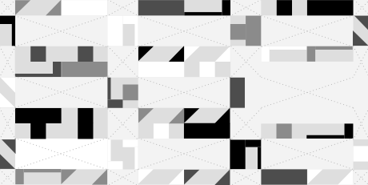
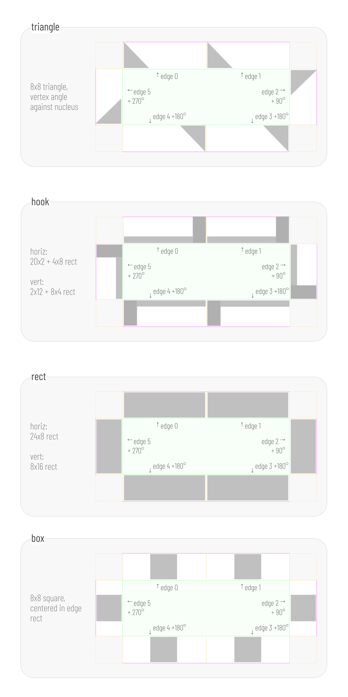
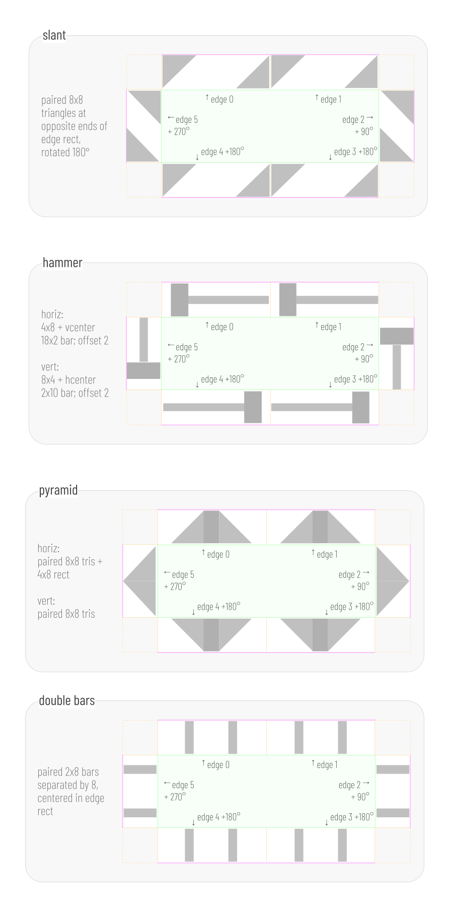

# entviz
Entviz is a simple way to visualize values with high entropy &mdash; cryptographic keys and signatures, UUIDs, blockchain payment addresses, post-quantum keys, genomes, and so forth &mdash; so a human can compare them visually. The goal is to allow an untrained adult with reasonably good vision to easily decide whether two chunks of entropy are the same or different.

**DRAFT — version 3.** Version 2 introduced the fingerprint, large-input handling, the gestalt channels, and the shape rename. Version 3 refines several of those channels in response to real-world readability problems observed in v2 output:

* The color bar's band heights now use a `count⁴` skew so the dominant color visibly dominates, instead of producing roughly-equal stripes for typical inputs.
* The color bar gains a true visible frame (black 1-px lines on both its left and right edges) and doubles in width (from GM to edge_size), so it reads as a deliberate inset panel rather than a naked leftmost strip.
* The shape count summary renders at 90% of the reference font size (or smaller if the cell text is smaller), in dark gray (#444), so it reads as a quiet summary rather than competing with the cell text.
* The ellipse overlay is comprehensively reworked: anchored at a strictly-interior grid corner, sized to produce a visible curve inside the grid (not just a flat clipped edge), clipped to the grid rect (not the bounding rect), with all entropic parameters discretized to 16 levels. Skipped entirely for inputs under 256 bits.
* The hex font-overflow bug is fixed: when the input produces 6-character tokens, the rendered font size shrinks to 75% of the reference so the text fits inside the nucleus. This introduces the **reference font size** / **rendered font size** distinction described below.

The geometry of grids and cells is essentially unchanged; the changes above are confined to channels overlaid on or beside the grid.


Compare [entmotif](https://dhh1128.github.io/entmotif), which turns entropy into music. The excellent [randomart](http://www.dirk-loss.de/sshvis/drunken_bishop.pdf) algorithm used with SSH keys is also related; it has a similar goal to entviz, but accepts different constraints and uses a different approach.

## Requirements
* Work in environments that can draw bitmapped or vector graphics.
* Losslessly represent all bits of entropy up to 512 bits. For larger inputs, losslessly represent the first and last 256 bits in the text channel, and bind the entire input through the fingerprint.
* Make it easy to read the entropy value out loud without the reader losing track of where they are.
* Support efficient partial comparisons (spot-checking).
* Guarantee that input entropy with even minor differences produces obvious visual differences, even when the input lacks an avalanche effect of its own.
* Uses 16 million colors (R*256, G*256, B*256). However, guarantee that entropy with even minor differences continues to have obvious visual differences in 256-color environments and in 256 shades of gray.
* Be usable by people with red-green, blue-yellow, and complete color blindness.
* Be trivial to implement correctly, with no significant dependencies.

## Nonrequirements
* Make it easy to remember all the details in a visualization. (Remembering a few arbitrarily chosen features of an entviz should be easy, but remembering all its details is unrealistic. The more appropriate goal is easy comparison to a saved copy.)
* Work in pure text environments. (Few pure text environments exist; even linux shells can save a file for viewing in a browser. Use randomart or invent a variation on this algorithm instead.)

## Concepts
A diagram produced by this algorithm is called an **entviz**. Entvizes can be categorized according to the dimensions of the grid into which they render: a "3x4 entviz", a "5x9 entviz", etc. Dimensions are given in <var>Width</var> x <var>Height</var> order. The maximum expressive **capacity** of an entviz of dimensions NxM is equal to 24 * N * M bits, although slightly less information may be communicated, depending on how the entropy is serialized to text.

The input being visualized is the **entropy**. The entropy is serialized to text and chopped into **tokens**, each of which represents 24 bits of entropy (or as close as possible on even character boundaries). The number of tokens is the **token count**.

The **fingerprint** is the SHA-512 hash of the normalized entropy. Because the fingerprint is produced by a cryptographic hash, it exhibits a strong avalanche effect: a single-bit change anywhere in the entropy changes roughly half the bits of the fingerprint. This is what lets entviz amplify differences even when the entropy itself is chosen rather than generated (for example, a UUID, a raw hex string, or a base64url blob), and what lets entviz handle inputs of any size. The fingerprint is tokenized exactly as the entropy is &mdash; into 24-bit chunks of base64url text. A token of the fingerprint is called an **ftok**. Because SHA-512 is always 512 bits (64 bytes), the fingerprint always yields exactly 22 ftoks: 21 full ftoks of 24 bits each, plus one partial ftok formed from the trailing byte and extended to 24 bits as described below.

Most of the entviz is drawn from the fingerprint rather than from the entropy directly. Specifically, the text of each cell and the background color of each cell's nucleus are derived from the **entropy**, preserving losslessness for inputs of 512 bits or less. Everything else &mdash; edge colors, edge shapes, the median and quartile calculations, blank cell placement, the entviz background color, the color bar, the shape count summary, and the ellipse overlay &mdash; is derived from the **fingerprint**.

## Guarantees
Each entviz conveys its entropy fully and independently, in a first visual channel, as text. If the text in an entviz is read aloud, *taking into account case-sensitivity*, all information is transferred. Text is tokenized into cells for efficient and reliable reading, and the cells are organized into a grid, which should be read left-to-right and top-to-bottom. For inputs of 512 bits or less, this text channel is fully lossless. For inputs greater than 512 bits, the text channel displays the first 256 bits and the last 256 bits of the entropy, separated by a blank cell; the full input is still bound into the visualization through the fingerprint, which drives all other channels.

The text channel does not, by itself, provide a visual avalanche effect: two inputs that differ by a single character will show nearly identical text. Avalanche is provided by the fingerprint-driven channels. The text channel's role is verbatim fidelity, not difference amplification, and it should be understood as one channel among several rather than a sole comparison method.


Each entviz also conveys its entropy, in a second visual channel, via the shapes and colors in the edges of its cells. These are derived from the fingerprint. Shapes in edges are carefully chosen to be visually distinct from one another even when they are quite small and pixelated. Shapes in edges sometimes connect to each other to make larger patterns. This allows some valid gestalt judgments and decreases the arbitrary noise that makes QR codes unmemorable for humans. Each edge shape is filled with a gradient that runs from the nucleus background color at the nucleus boundary to the nominal edge color at the cell boundary, so the nucleus color appears to bleed outward into the surrounding shapes. This ties each cell together as a single perceived object.


The colors used with edges are selected so their differences are detectable to someone who has difficulty perceiving colors, and also so they remain quite distinct when rendered in print in grayscale.



Each entviz conveys its entropy, in a third visual channel, via the color that provides the background for the text in each cell. This nucleus background color is derived from the entropy, so for inputs of 512 bits or less it remains lossless. However, fine gradations in the colors of the nucleus may not be perceptible to the human eye, and these gradations will disappear if less than 16 million colors are displayable. Therefore, the colors in the nucleus are a partially redundant hint; they will never be misleading, but they should not be a primary comparison method.


Zero or more cells in an entviz may be blank. The positioning of blank cells derives from the fingerprint. An entviz also contains small *quartile* marks on four cells. Blank cells and quartile marks are easily checked by viewers, and act as a sort of visual CRC. They surface differences that may be otherwise hidden in the middle of long strings and at the end of individual tokens.


Each entviz displays a **color bar** along its left edge and a **shape count summary** along its bottom. Both are derived from the fingerprint. They provide redundant channels that allow rapid gestalt comparison: two entvizes with different color or shape distributions will differ visibly in these summary regions even before a cell-by-cell comparison begins.

Each entviz that has at least 256 bits of input entropy also displays a partially transparent **ellipse overlay** derived from the fingerprint. The ellipse is anchored at a corner *interior* to the grid (a cell-corner that is not on the grid's outer boundary), sized to produce a visibly curved arc clipped within the grid, and it darkens or lightens the edge shapes beneath it without affecting the nuclei or text. This creates a large, organic shape that contributes to the overall gestalt identity of the entviz and makes a quick, high-level glance more informative. Inputs smaller than 256 bits omit the overlay entirely; their grids are too small for the curve to be readable.

## Thoughts About Comparing

*Note: when reading entviz text aloud, the convention is to precede each capital letter with the one-syllable prefix "cap", to read the hyphen character - as "dash", and to read the underscore character as "under". This minimizes the number of syllables while eliminating all ambiguity. This convention applies only to the token text in the grid; the letters in the shape count summary are shape names, not text to be read with this convention.*

* display counts of each shape and each color
* allow toggling off each channel, each color, each shape, CRC
* spotcheck by reading a row or column or by having a column / row slider
* render with a legend for rows and columns

## Entviz Algorithm
1. Normalize the input.
    * Remove all whitespace.
    * Detect the entropy type, if possible, and split the input into prefix, core, and suffix, with all three pieces of data normalized. This should eliminate case differences, putting the entropy in canonical case, with canonical punctuation. It should identify prefixes that are not true entropy (e.g., the "0x" prefix on an Ethereum address, the "AAAA" at the front of an SSH key, etc.). It should identify suffixes that are checksums or derivations of the true entropy. The reference implementation in python has an `entropy` module with a `parse(txt)` method that can be used as an oracle, and it has unit tests that can provide a test vector.
    * If the input entropy has an unrecognized type, treat it as an arbitrary bag of bits: encode the input string to UTF-8 bytes, then re-render those bytes as a URL-safe base64 string (no padding). The resulting base64 string is treated as the normalized core; the type is `base64`. UTF-8 is the canonical byte encoding for the fallback path; implementations MUST NOT use other encodings (Latin-1, UTF-16, etc.) because that would change the fingerprint of identical-looking inputs.

1. Compute the **fingerprint** as the SHA-512 hash of the normalized entropy bytes. Serialize the 64-byte fingerprint to base64url text and split it into **ftoks** using exactly the same tokenization rule applied to the entropy: each ftok represents 3 bytes (24 bits) of the fingerprint. This yields 21 full ftoks plus one partial ftok formed from the trailing byte; extend the partial ftok to 24 bits by repeating its low-order bits, exactly as for a partial token. The fingerprint therefore always provides 22 ftoks. Assign each ftok an **ftok index** between 0 and 21, inclusive. The fingerprint is never displayed as text.

1. Split the entropy string into tokens. Each token represents 3 bytes (24 bits) of binary entropy, or as close to that amount as possible while respecting whole-character boundaries of the underlying encoding. The **token length** (chars per token) is determined by the **alphabet** the parser declared for the input — not by inspecting the content of the core or by string-matching the type name. (Content inspection is unsound: a base32 value, for instance, can use only characters from the hex alphabet and would be indistinguishable from hex on inspection. Each parser knows which alphabet its core uses and must declare it.) The alphabets in this spec are:

    * **hex** (4 bits per char): token length = 6 characters (= 24 bits). Used by raw hex inputs, hex multihash, UUID, and Ethereum addresses.
    * **base58** (6 bits per char in this spec's tokenization; note that base58's *true* information density is ~5.86 bits/char, but this spec treats base58 chars as 6-bit values for tokenization purposes, matching the reference implementation): token length = 4 characters (= 24 bits). Used by Bitcoin legacy, Ripple, Litecoin legacy, Cardano Byron, and IPFS CID v0.
    * **base64** and **base64url** (6 bits per char): token length = 4 characters (= 24 bits). Used by CESR, SSH keys, EOS addresses, DIDs, and the unknown-input fallback (the input is re-encoded as base64url before tokenization).

    Future spec revisions will introduce **base32** and **bech32** alphabets at 5 bits per char (token length determined as below); until then, input types whose cores use those encodings (Bitcoin SegWit, Bitcoin Cash, Cardano Shelley, Stellar, IPFS CID v1) are declared as base64 by their parsers — a known-incorrect-but-stable placeholder. The general rule is: token length = `24 / bits_per_char` when that divides evenly; otherwise the parser specifies its own token length. Call the number of tokens the **token count**. Assign to each token a **token index** between 0 and *token count* - 1, inclusive. If the entropy is greater than 512 bits, do not tokenize the whole input; instead tokenize only the first 256 bits and the last 256 bits of the entropy, and treat the two groups as separated by a single blank cell. In all cases, *token count* will be at most 22.

    

    Also, if a token represents less than 24 bits of entropy, extend the bits of the token by repeating low-order bits until a full 24 bits is used. Call the 24-bit value associated with the token its **quant**.

    Specifically, given an integer value `v` with `actual_bits` bits of information (where `0 < actual_bits < 24`), the extension proceeds by repeated doubling of the current value, taking each pad chunk from the low-order bits of the *current* (already extended) value:

    ```
    quant = v
    while actual_bits < 24:
        shift = min(actual_bits, 24 - actual_bits)
        pad = quant & ((1 << shift) - 1)        # low-order `shift` bits of quant
        quant = (quant << shift) | pad
        actual_bits += shift
    ```

    Worked examples:

    * 8-bit value `0xAB` (binary `10101011`): iteration 1 (`shift=8`) → `0xABAB`; iteration 2 (`shift=8`) → `0xABABAB`. Final quant: `0xABABAB`.
    * 4-bit value `0x5` (binary `0101`): iteration 1 (`shift=4`) → `0x55`; iteration 2 (`shift=8`) → `0x5555`; iteration 3 (`shift=8`) → `0x555555`. Final quant: `0x555555`.
    * 12-bit value `0xABC`: iteration 1 (`shift=12`) → `0xABCABC`. Final quant: `0xABCABC` (one iteration suffices when `actual_bits` doubles cleanly to 24).

    The shift size at each step is `min(actual_bits, 24 - actual_bits)`, so the algorithm terminates in at most a few iterations regardless of the starting size.

1. The complete entropy is visualized as a rectangular **grid** consisting of a certain number of **cells**. Call this number of cells the **cell count**. Each token is rendered into one cell in the grid, and if the rectangle of the grid has more cells than *token count*, one or more cells will be empty.

    Grids of a single row or a single column are invalid: the minimum grid is 2 columns by 2 rows. Each cell touches its neighbors directly and has an aspect ratio of 2:1. Given a **target aspect ratio** for the entviz (or, if none is given, using 1:1 as the target), choose the grid layout that produces an overall rectangle with an aspect ratio closest to the target, without being less than the target when the ratios are written as fractions, and with at least 2 columns and 2 rows.

    >Using more entropy than the example we've been building, just to show how this works in more complicated situations: 256 bits of entropy is 44 base-64 characters or 11 tokens. 11 tokens can be rendered as a grid with 6 columns and 2 rows (rounding *token count* to 12; aspect ratio 12:2), 4 columns and 3 rows (8:3), 3 columns and 4 rows (6:4), or 2 columns and 6 rows (4:6). Given a *target aspect ratio* of 1:1, the grid layout with an aspect ratio closest to 1:1 but not less than 1:1 is the one with 3 columns and 4 rows, aspect ratio 6:4.

    

1. Moving from left to right and top to bottom &mdash; which is how ASCII text should read if it wraps &mdash; number the cells from 0 to N, and call the number associated with each cell its **cell index**. Assign a *cell index* to each token. Unless changed, the *cell index* of a token will equal its *token index*.

    

1. Define the **used ftoks** as the first *token count* ftoks of the fingerprint, taken in ftok index order. The used ftoks map one-to-one to tokens: the used ftok at index *i* corresponds to the token with *token index* *i*. (Because *token count* is at most 22 and the fingerprint provides 22 ftoks, there are always enough.) Any ftoks beyond *token count* are not used. From here on, all fingerprint-based calculations operate on the used ftoks. The 24-bit value of an ftok is its **quant**, defined exactly as for a token.

1. Sort the used ftoks in **ASCII order** &mdash; case-sensitive bytewise (lexicographic) comparison of the ftok's base64url text. Since base64url characters are all in the ASCII range, this is equivalent to UTF-8 bytewise comparison. Shorter strings sort before longer strings that share their full content as a prefix (standard lexicographic ordering; partial ftoks therefore sort below full ftoks that begin with the same chars). Use a secondary sort by *ftok index*, in case the same ftok appears in more than one place. Identify the first ftok in the sorted list that contains the median value. (If the count is even, use the first ftok from the middle pair.) Call this the **median ftok**.

1. Also sort the used ftoks by the ASCII order of their mirror image (with a secondary sort on the ftok index, in case the same ftok appears in more than one place). For example, if an ftok is "a4W6", its sort key would be "6W4a". If the number of used ftoks is not evenly divisible by 4, act as if 4 - (*token count* mod 4) blank items existed at the bottom of the list. Now divide the sorted list into 4 sections and call each section a **quartile**. Identify the first ftok in each quartile and call it the **first quartile ftok**, the **second quartile ftok**, and so on.

1. If *token count* is less than *cell count*, the grid will have blank cells. We want to use blank cells to create visual gaps in a consistent way that is more meaningful than simply putting all the blanks at the beginning or end, because this will aid comparison. Each used ftok corresponds to a token (and therefore to a cell); use that correspondence to locate the cells named below. Insert a blank cell at the *cell index* of the token corresponding to the *median ftok* by incrementing the *cell index* of all tokens whose *token index* >= that token's *token index*. This essentially shifts these tokens to the right or down in the grid. If *token count* + 1 is still less than *cell count*, insert a second blank cell before the cell of the last ftok in the ASCII-sorted list, again shifting cells that render after. If *token count* + 2 is still less than *cell count*, insert a third blank cell before the cell of the first ftok in the ASCII-sorted list, again shifting cells that render after. Do not perform more than 3 shifts. (For inputs greater than 512 bits, the blank cell separating the first and last 256-bit groups is in addition to these.)

1. Choose a fixed-width font such as Courier, and an appropriate font size for reading. In our example, we will use 12 point, but the algorithm will work at any reasonable font size. The size of the font determines the scale of the entviz.

1. Convert the point size of the font into pixels and call this value the **nucleus height**. Use the formula: pixels = (points * DPI) / 72. Most devices use 96 DPI, although other values are possible. At 96 DPI, a 12-point font = 16 pixels. This is the distance between the font's tallest ascender to its lowest descender, with a line height of 1.0, which allows some extra vertical space. It means that a 12-point font will render nicely, with appropriate extra space, in a rectangle that is 16 pixels high.

    The chosen point size is called the **reference font size**. Throughout this spec, all geometry — nucleus height, cell dimensions, grid dimensions, edge size, GM, bounding rect, color bar width — is derived from the reference font size. The reference is independent of the size actually applied to any specific piece of rendered text; some text elements are drawn at a smaller **rendered font size** (see the cell rendering algorithm and the shape count summary below). The rendered font size never affects geometry.

1. Calculate the **cell width** by multiplying *nucleus height* by 4, and calculate **cell height** by multiplying *nucleus height* by 2. Calculate the **grid width** by multiplying *cell width* by number of columns, and **grid height** by multiplying *cell height* by number of rows. Calculate the **nucleus width** by multiplying *nucleus height* by 3. Calculate the **edge size** by dividing *nucleus height* by 2. Calculate the **edge rect length** by dividing *nucleus width* by 2. Calculate the **grid margin** (abbreviated GM) by dividing *edge size* by 2; this equals half the width of a left or right edge rect. At 96 DPI with a 12-point font, *edge size* = 8 pixels and GM = 4 pixels.

    

1. Allocate the **grid rect**, a rectangle of dimensions *grid width* x *grid height* that contains only the cells of the grid. We will assume that the top left corner of the *grid rect* is at position (0, 0) on the canvas for the purpose of the cell calculations, but its actual position is determined by the bounding rect below.

1. Allocate the **bounding rect**, the outermost rectangle of the entviz. It contains the *color bar* at its left, the *grid rect*, and the *shape count summary*. Its dimensions are:

    * width = 1 + *edge size* + 1 + GM + *grid width* + GM + 1
    * height = 1 + GM + *grid height* + GM + *nucleus height* + GM + 1

    Read the width left to right: a 1-pixel black left border; then the *color bar* (width = *edge size* = 2·GM); then a 1-pixel black interior separator between the color bar and the grid area; then a GM margin; then the *grid rect*; then a GM margin; then a 1-pixel black right border. Read the height top to bottom: a 1-pixel black top border; then a GM margin; then the *grid rect*; then a GM margin; then one line (*nucleus height*) for the *shape count summary*; then a GM margin; then a 1-pixel black bottom border.

    Fill the bounding rect with white. Draw a 1-pixel black line along all four edges of the bounding rect, and a 1-pixel black line down the column between the color bar and the grid area (forming the color bar's right edge). The color bar is the inset rectangle bounded on its left by the bounding rect's left black border and on its right by the interior separator; its drawing region runs from y = 1 (just below the top black border) to y = bounding_height − 1 (just above the bottom black border). Position the *grid rect* with its top-left corner at (1 + *edge size* + 1 + GM, 1 + GM) within the bounding rect.

    Use the *grid rect* as a clipping region for the ellipse overlay (see below). The color bar, shape count summary, and black border lines are drawn outside the grid rect and need no clipping. Draw all clipped content first; draw the black border lines last so the borders are never overwritten.

1. Let the array of **possible edge colors** be [white - `#ffffff`, gold - `#ffd966`, red - `#ff3f2f`, blue - `#2f3fbf`, black - `#000000`]. The first four entries (indices 0-3) are the **background candidates**; black at index 4 is *always* an edge color and is never selected as the entviz background. This is intentional: black is too visually heavy to serve as a background.

    

    Select the 2 low-order bits of the *quant* of the *median ftok*. Use this 2-bit number as an index into the background-candidates portion of the array (indices 0-3) to select the **entviz background color**. For example, if the 2-bit number == 1, the background color is gold. Remove the selected color from the full *possible edge colors* array to generate a new array consisting of the 4 remaining colors, and call this the **edge colors** array. Black is therefore always present in the *edge colors* array regardless of which background was chosen.

1. Let *array 0* be the **cubist** shape set `[C1, C2, C3, C4]`. C1, C2, and C3 are filled shapes drawn from path data; C4 is **empty** (renders as no ink). Each shape's slot index in the array (1, 2, or 3 for non-empty members; 4 for empty) identifies it in the *shape count summary*.

    

    Let *array 1* be the **polygon** shape set `[P1, P2, P3, P4]`. Same shape: three filled shapes plus an empty member at slot 4.

    

    Inspect the **least-significant bit** of the *quant* of the *second quartile ftok* (i.e., `quant & 0x01`). If that bit is 0, the **edge shapes** array is exactly *array 0* (the cubist set). If that bit is 1, the **edge shapes** array is exactly *array 1* (the polygon set). The 4 entries of the chosen set become the per-cell edge shape menu used in the cell rendering algorithm; bits 1, 2, and 3 of the second quartile ftok's quant are not consulted by this step and are reserved for future use.

    The intent: an entviz exhibits a single coherent shape "look" (cubist or polygon) across every edge of every cell. Two entvizes whose only difference is which set they drew from should be obviously distinguishable at a glance; mixing slots across the two sets would dilute that gestalt difference.

1. Define two integers, **shape shift** and **color shift**, and set both of their values to 0.

1. Inside the *grid rect*, render each token T into its appropriate cell in the grid, using its corresponding used ftok, *edge colors*, *edge shapes*, *shape shift* and *color shift*, according to the [cell rendering algorithm](#cell-rendering-algorithm) below.

1. Draw a circle with diameter = *edge size* / 2, centered vertically and horizontally, in a corner rect of each *quartile ftok*'s corresponding cell. For the first quartile ftok, place the circle in the top left corner of the cell, and use the first item in the *edge colors* array as its fill color. For the second, place the circle in the top right, using the second edge color. For the third, place the circle in the bottom right, using the third edge color. For the fourth, in the bottom left, using the fourth edge color.

1. Draw the **color bar** in the inset rectangle described in the bounding-rect section above (left border at x = 1, right border at x = 1 + *edge size*, drawing height = bounding rect height − 2, since the top and bottom black borders cover the top and bottom pixel rows). Tally how many times each of the four *edge colors* is used across all edge rects actually drawn, excluding the edge rects of blank cells. For each color whose count is greater than zero, compute `count^4`. Divide the color bar's drawing height into horizontal bands, one per nonzero color, with each band's height proportional to that color's `count^4` value as a share of the sum of all four `count^4` values. The fourth-power skew amplifies the dominance of the most-used color so the bar reads as a clear pecking order rather than four near-equal stripes (which is what a raw-count distribution typically produces). Order the bands by descending count (equivalently, descending `count^4`, since `x^4` is monotonic for non-negative x), most frequent at the top; break ties by the order of the color in the *edge colors* array. Fill each band with its color.

1. Draw the **shape count summary** (abbreviated SCS) below the grid. Tally how many times each of the (up to 8) *edge shapes* is used across all edge rects actually drawn, excluding the edge rects of blank cells. For each shape whose count is greater than zero, form a token of the form `X##`, where `X` is the shape's identifying letter and `##` is its count, zero-padded to two digits. (Counts will not exceed 99 for any practical grid; the field is two digits wide.) Sort these tokens by descending count, breaking ties alphabetically by shape letter. Join them with single spaces and render the resulting string in the same fixed-width font as the cell text. The SCS **rendered font size** is `min(round(0.9 × reference_font_size), cell_text_rendered_font_size)` — i.e., 90% of the reference (rounded to whole points) unless the cell text is itself smaller than that, in which case the SCS matches the cell text size. This keeps the SCS visually secondary to the cell text (it never appears larger). Fill the text with `#444` (dark gray) rather than pure black, reinforcing the visual hierarchy. Right-justify the string so its right edge aligns with the right edge of the *grid rect*, and position its baseline so the line occupies the *nucleus height* reserved for it, with its top edge at *grid rect* bottom + GM. The string extends left only as far as its content requires; it is at most about 16 characters wide and never wider than two columns of cells.

    In interactive environments, hovering over an edge shape should reveal a tooltip giving the shape's full name.

1. Draw the **ellipse overlay** — unless the input has fewer than 256 bits, in which case skip the overlay entirely and proceed to the next step. For inputs ≥ 256 bits, derive the overlay's parameters from fingerprint bytes (the 64 bytes of the raw SHA-512 digest, numbered 0 to 63):

    * **anchor**: enumerate the **interior corners** of the grid — every cell-corner point that lies *strictly inside* the grid rect, i.e., not on its outer boundary. For an N-column × M-row grid this list has `(N − 1) × (M − 1)` points; enumerate them in row-major order (left to right, top to bottom). Use fingerprint byte 60, taken modulo the number of points in this list, to select the anchor. The anchor is the *center* of the ellipse, not a point on its boundary.
    * **rx (horizontal semi-axis)**: compute `rx_step = digest[61] mod 16`. Then `rx = r_min + (rx_step / 15) × (r_max − r_min)`, where `r_min = nucleus_height` (= cell_height / 2) and `r_max = d_far − cell_width`. `d_far` is the distance from the chosen anchor to the farthest of the grid rect's four outer corners. The lower bound prevents the curve from being too small to read; the upper bound prevents it from being so large that the visible arc looks flat (the v2 failure mode).
    * **ry (vertical semi-axis)**: compute `ry_step = digest[62] mod 16`. Then `ry = r_min + (ry_step / 15) × (r_max − r_min)`, with the same `r_min` and `r_max` as rx. `rx` and `ry` are drawn independently, so the ellipse ranges from a near-circle to a strongly elongated shape.
    * **rotation**: compute `rotation_step = digest[63] mod 16`. Then `rotation = (rotation_step / 15) × 180°`. Rotates the ellipse around the anchor.
    * **opacity**: fixed at 20%. No entropy.

    16 discrete steps per parameter is intentional: it's near the just-noticeable-difference threshold for both pixel-level radius changes and degree-level rotations, so adjacent steps produce overlays that are visibly distinct from each other.

    Choose the fill: convert the entviz background color to HLS; if its luminosity is greater than 0.5, fill the ellipse with black; otherwise fill it with white. Apply the fill at 20% opacity.

    **Clip the overlay to the grid rect**, not the bounding rect. The overlay must never appear outside the cells of the grid (it must not leak into the margins, color bar, or shape count summary area).

    Draw the overlay above the edge layer but below the nucleus layer, so that nucleus background colors and text are never affected by it.

    **SVG implementation note.** When emitting the overlay in SVG, the `clip-path` attribute must live on a non-rotated parent `<g>` element, with the `transform="rotate(…)"` on the `<ellipse>` inside it. If both attributes go on the same element, SVG resolves the clipPath in the element's post-transform coordinate system — i.e., the clip rectangle rotates along with the ellipse. The two-element structure keeps the clip axis-aligned in screen space while the ellipse rotates within it.

## Cell Rendering Algorithm

A cell is rendered from a token T and the used ftok F that corresponds to it. The token supplies the cell's text and nucleus background color; the ftok supplies the edge colors and shapes.

1. For a given token T, identify the **origin point** within the *grid rect* with coordinates *x*, *y* with the following formulas: *x* = (*T.cell index* mod *column count*) * *cell width*; *y* = int(*T.cell index* / *column count*) * *cell height*.

1. Convert the *quant* for T into an RGB value the same way CSS does it &mdash; red in the low-order byte, and so forth &mdash; and call this RGB value the **nucleus background color**. Also convert the *nucleus background color* into the HLS color system and call the result the **HLS nucleus background color**. If the luminosity of the *HLS nucleus background color* is < 0.5, let the **foreground color** be white (#ffffff). Otherwise, let it be black (#000000).

1. Draw a **nucleus rect**. Dimensions are *nucleus width* x *nucleus height*. Top left corner is at *x* + *edge size*, *y* + *edge size*. Fill color = *nucleus background color*.

1. Determine the **cell text rendered font size** based on the token character count:

    * If the token is 4 characters (base64, base58): rendered font size = the reference font size.
    * If the token is 6 characters (hex): rendered font size = `round(0.75 × reference_font_size)` (rounded to the nearest whole point, with ties broken toward even). The 75% factor leaves ~4.8 px of horizontal slack inside the nucleus even on monospace fonts with the widest char-width ratios.
    * Generalized rule, in case future spec revisions introduce additional token character counts:
      ```
      rendered_font_size_pt = round(reference_font_size_pt × max(0.75, min(1.0, 4 / token_chars)))
      ```
      This collapses to the two cases above for current token types: 4-char → reference, 6-char → 75% of reference. The 0.75 floor ensures readability remains acceptable even if a future token type would technically permit further shrinking.

    Geometry (grid, nucleus, cell positions) does not change with the rendered font size — only the size of the glyphs drawn inside the nucleus does. Using the *foreground color*, write the text of the token on top of the *nucleus rect* at the rendered font size, centering it vertically and horizontally.

1. Convert the *quant* of the used ftok F into 6 4-bit numbers and call these the **edge nums**. Assign the edge numbers an **edge index**, with index 0 for bits 0-3 and continuing up to index 5 for bits 20-23.

1. Divide the region surrounding the *nucleus rect* into 6 **edge rects** &mdash; two above the nucleus, two below, and one on either side. The 4 corners of the cell are **corner rects** and are not included in any *edge rect*. The *edge rects* above and below the nucleus will have a width of *edge rect length* (= *nucleus width* / 2) and a height of *edge size*. The *edge rects* on either side will have a width of *edge size* and a height of *nucleus height*. Beginning with the top left *edge rect*, and moving clockwise, assign an **edge index** to each *edge rect*.

1. For each *edge num*, select the 2 low-order bits and call this the **color base**. XOR the *color base* with the 2 low-order bits of the *color shift* and call the result the **color index**. Select a color from the *edge colors* array using the *color index*, and call it the **edge color**. Increment *color shift* by 1.

1. For each *edge num*, select the 2 high-order bits and call this the **shape base**. XOR the *shape base* with the 2 low-order bits of the *shape shift* and call the result the **shape index**. Select a shape from the *edge shapes* array using the *shape index*, and call it the **edge shape**. If (T.*cell index* mod *column count*) != *column count* - 1, increment *shape shift* by 1.

1. After all 6 *edge nums* for the cell have been processed, if (T.*cell index* mod *column count*) == *column count* - 1 (i.e., this cell is in the last column of the grid), add *shape shift* to *color shift*. This adjustment runs once per cell, not once per edge.

1. Inside the logical region belonging to each *edge rect*, draw the *edge shape* using a linear gradient as its fill. The gradient runs from the *nucleus background color* at the boundary the edge rect shares with the *nucleus rect* to the *edge color* at the opposite (outer) boundary of the edge rect, perpendicular to the shared boundary. This makes the nucleus color appear to bleed outward into the shape before resolving to the edge color. All triangles are 45&deg;x45&deg;x90&deg;. Shapes are considered standard in edge 0 and edge 1. They rotate 90&deg; (and, in some cases, compress) for edge 2. They rotate 180&deg; from standard in edges 3 and 4. They rotate 270&deg; from standard (and, in some cases, compress) for edge 5. The shape diagrams above show the dimensions and orientations of each shape.

1. The 4 *corner rects* of each cell (each of size *edge size* x *edge size*) touch the nucleus only at a point, not along any side. Quartile marks are drawn in the corner rects of the four quartile cells as described above. In v3-conforming output, all other corner rects MUST be left empty (no drawing within those rectangles). The corner-rect region is reserved as an extension point for future gestalt features, such as connectors that join the shapes of adjacent edge rects into larger emergent patterns; experimental implementations exploring such features are not v3-conforming until a future revision normatively defines the behavior.
