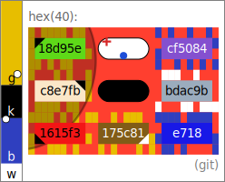

# entviz

**entviz** turns a high-entropy value — a cryptographic key or signature, a
UUID, a blockchain address, a post-quantum key, a genome — into a compact SVG
diagram that an ordinary person with reasonably good vision can compare at a
glance. The goal is simple: let a human decide *"are these two blobs of entropy
the same or different?"* without reading 88 characters of base64 one symbol at
a time.

Every value is rendered across several redundant visual channels — text cells,
a per-cell surround pattern, nucleus colors, a fingerprint-derived color bar,
blank-cell markers, and an ellipse overlay — so that even a single-bit
difference in the input is obvious, and so that color-blind viewers and
monochrome displays still get a reliable signal.

<figure markdown="span">
  { width="320" }
  <figcaption>This repository itself, rendered as an entviz of its own root commit hash.</figcaption>
</figure>

## Explore

- **[Specification](spec.md)** — the full algorithm (current: v15): normalization,
  tokenization, the fingerprint, geometry, and every visual channel.
- **[Gallery](gallery.html)** — entvizes across real input types (UUIDs, hex,
  blockchain addresses, SSH keys, ULIDs, LEIs, snowflakes) and avalanche pairs.
- **[Paper](entviz-paper.md)** — the longer-form analysis and design rationale.
- **[Developers (README on GitHub)](https://github.com/dhh1128/entviz#readme)** —
  install with `uv`, run the CLI, run the tests, and cut releases.

A [threat model](threat-model.md) covering the comparison guarantees is also
available.

## Implementations

entviz is a language-independent specification; every implementation below passes
the same shared conformance corpus. **[▶ Try it live in the browser](https://dhh1128.github.io/entviz-js/)**
— the JavaScript/React playground lets you render a value and compare two.

| Language | Repository | Package | API docs |
|---|---|---|---|
| **Python** (reference) | [entviz](https://github.com/dhh1128/entviz) | [PyPI `entviz`](https://pypi.org/project/entviz/) | this site + [`spec.md`](spec.md) |
| **Rust** | [entviz-rs](https://github.com/dhh1128/entviz-rs) | [crates.io `entviz`](https://crates.io/crates/entviz) | [docs.rs](https://docs.rs/entviz) |
| **TypeScript / JS** | [entviz-js](https://github.com/dhh1128/entviz-js) | [npm `@entviz/core`](https://www.npmjs.com/package/@entviz/core) | [TypeDoc](https://dhh1128.github.io/entviz-js/api/) |
| **React** | [entviz-js `packages/react`](https://github.com/dhh1128/entviz-js/tree/main/packages/react) | [npm `@entviz/react`](https://www.npmjs.com/package/@entviz/react) | — |
| **Java** | [entviz-java](https://github.com/dhh1128/entviz-java) | [Maven `io.github.dhh1128:entviz`](https://central.sonatype.com/artifact/io.github.dhh1128/entviz) | [javadoc.io](https://javadoc.io/doc/io.github.dhh1128/entviz) |
| **Go** | [entviz-go](https://github.com/dhh1128/entviz-go) | [pkg.go.dev](https://pkg.go.dev/github.com/dhh1128/entviz-go) | [pkg.go.dev](https://pkg.go.dev/github.com/dhh1128/entviz-go) |

## At a glance

- Losslessly represents up to 512 bits in the text channel; larger inputs show
  head + a domain-separated fingerprint readout in the middle + tail, and bind
  the whole input through the fingerprint.
- Amplifies single-bit differences via a SHA-512 fingerprint, even when the
  input itself has no avalanche effect.
- Usable under red-green, blue-yellow, and complete color blindness.
- Trivial to implement, with no significant dependencies.
