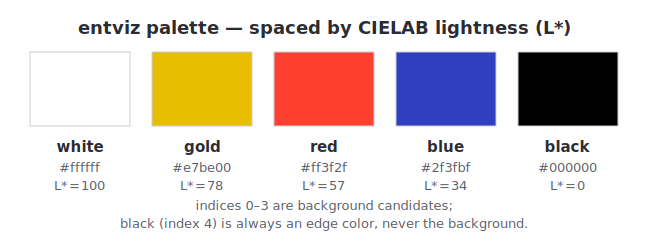
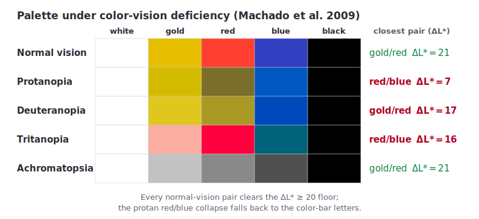

# entviz

**Version: 6**

Entviz is a simple way to visualize values with high entropy &mdash; cryptographic keys and signatures, UUIDs, blockchain payment addresses, post-quantum keys, genomes, and so forth &mdash; so a human can compare them visually. The goal is to allow an untrained adult with reasonably good vision to easily decide whether two chunks of entropy are the same or different.


Compare [entmotif](https://dhh1128.github.io/entmotif), which turns entropy into music. The excellent [randomart](http://www.dirk-loss.de/sshvis/drunken_bishop.pdf) algorithm used with SSH keys is also related; it has a similar goal to entviz, but accepts different constraints and uses a different approach.

## Requirements
* Work in environments that can draw bitmapped or vector graphics.
* Losslessly represent all bits of entropy up to 512 bits. For larger inputs, losslessly represent the first 8 and last 8 tokens in the text channel (192 bits each for 4-/6-bit alphabets; 160 bits for the 5-bit alphabets, where a token is 4 characters); additionally show 4 tokens rendering a second, domain-separated fingerprint as hex in the text channel; and bind the entire input through the fingerprint.
* Make it easy to read the entropy value out loud without the reader losing track of where they are.
* Support efficient partial comparisons (spot-checking).
* Guarantee that input entropy with even minor differences produces obvious visual differences, even when the input lacks an avalanche effect of its own.
* Uses 16 million colors (R*256, G*256, B*256). However, guarantee that entropy with even minor differences continues to have obvious visual differences in 256-color environments and in 256 shades of gray.
* Be usable by people with red-green, blue-yellow, and complete color blindness.
* Be trivial to implement correctly, with no significant dependencies.

## Nonrequirements
* Make it easy to remember all the details in a visualization. (Remembering a few arbitrarily chosen features of an entviz should be easy, but remembering all its details is unrealistic. The more appropriate goal is easy comparison to a saved copy.)
* Work in pure text environments. (Few pure text environments exist; even linux shells can save a file for viewing in a browser. Use randomart or invent a variation on this algorithm instead.)

## Concepts
A diagram produced by this algorithm is called an **entviz**. Entvizes can be categorized according to the dimensions of the grid into which they render: a "3x4 entviz", a "5x9 entviz", etc. Dimensions are given in <var>Width</var> x <var>Height</var> order. The maximum expressive **capacity** of an entviz of dimensions NxM is equal to 24 * N * M bits, although slightly less information may be communicated, depending on how the entropy is serialized to text.

The input being visualized is the **entropy**. The entropy is serialized to text and chopped into **tokens**, each of which represents 24 bits of entropy (or as close as possible on even character boundaries). The number of tokens is the **token count**.

The **fingerprint** is the SHA-512 hash of the normalized entropy. Because the fingerprint is produced by a cryptographic hash, it exhibits a strong avalanche effect: a single-bit change anywhere in the entropy changes roughly half the bits of the fingerprint. This is what lets entviz amplify differences even when the entropy itself is chosen rather than generated (for example, a UUID, a raw hex string, or a base64url blob), and what lets entviz handle inputs of any size. The fingerprint is tokenized exactly as the entropy is &mdash; into 24-bit chunks of base64url text. A token of the fingerprint is called an **ftok**. Because SHA-512 is always 512 bits (64 bytes), the fingerprint always yields exactly 22 ftoks: 21 full ftoks of 24 bits each, plus one partial ftok formed from the trailing byte and extended to 24 bits as described below.

Most of the entviz is drawn from the fingerprint rather than from the entropy directly. Specifically, the text of each cell and the background color of each cell's nucleus are derived from the **entropy**, preserving losslessness for inputs of 512 bits or less. Everything else &mdash; the surround-box pattern in each cell, the median and quartile calculations, blank cell placement, the entviz background color, the color bar, and the ellipse overlay &mdash; is derived from the **fingerprint**.

## Guarantees
Each entviz conveys its entropy fully and independently, in a first visual channel, as text. If the text in an entviz is read aloud, *taking into account case-sensitivity*, all information is transferred. Text is tokenized into cells for efficient and reliable reading, and the cells are organized into a grid, which should be read left-to-right and top-to-bottom. For inputs of 512 bits or less, this text channel is fully lossless. For inputs greater than 512 bits, the text channel displays the **head** (first 8 tokens), the **tail** (last 8 tokens), and 4 **middle tokens** rendering a second, domain-separated fingerprint as hex, separated by blank cells. (Head and tail cover 192 bits each for 4-/6-bit alphabets and 160 bits for the 5-bit alphabets — see the large-input handling subsection.) The full input is still bound into the visualization through the fingerprint, which drives all other channels.

The head, middle, and tail are not contiguous, and the middle cells are a fingerprint readout rather than input bytes: the cells should NOT be read as a linear scan of the input. The top label strip carries a loud `fingerprint of` marker when the input is truncated, signalling that the text channel alone is no longer lossless for the input. The original byte length is given by the type-label parenthetical (e.g. `hex(200)`) that immediately follows the marker.

The text channel does not, by itself, provide a visual avalanche effect: two inputs that differ by a single character will show nearly identical text. Avalanche is provided by the fingerprint-driven channels. The text channel's role is verbatim fidelity, not difference amplification, and it should be understood as one channel among several rather than a sole comparison method.


Each entviz also conveys its entropy, in a second visual channel, via the **surround** around each cell's nucleus. The surround is composed of 24 small rectangles arranged in a ring (10 above the nucleus, 10 below, 2 on each side). Each box is either filled or empty, controlled by one bit of the cell's ftok quant; the filled boxes use a single per-cell **edge color** chosen as the palette entry perceptually closest to the cell's nucleus background. The result reads as the nucleus color "leaking outward" through a quant-controlled pixel pattern.


The edge color is chosen from a fixed 4-color palette (the 4 non-background entries of \[white, gold, red, blue, black\]). The palette is intentionally simple, and perceptual selection ensures that even color-blind viewers can detect each cell as a separate object distinct from the background.

Each entviz conveys its entropy, in a third visual channel, via the color that provides the background for the text in each cell. This nucleus background color is derived from the entropy, so for inputs of 512 bits or less it remains lossless. However, fine gradations in the colors of the nucleus may not be perceptible to the human eye, and these gradations will disappear if less than 16 million colors are displayable. Therefore, the colors in the nucleus are a partially redundant hint; they will never be misleading, but they should not be a primary comparison method.


Zero or more cells in an entviz may be blank. The positioning of blank cells derives from the fingerprint. An entviz also contains small *quartile* marks on four cells. Blank cells and quartile marks are easily checked by viewers, and act as a sort of visual CRC. They surface differences that may be otherwise hidden in the middle of long strings and at the end of individual tokens.


Each entviz displays a **color bar** along its left edge. It is derived from the fingerprint and provides a redundant channel that allows rapid gestalt comparison: two entvizes with different 2-bit-pattern histograms will differ visibly in the bar even before a cell-by-cell comparison begins.

Each entviz that has at least 256 bits of input entropy also displays a partially transparent **ellipse overlay** derived from the fingerprint. The ellipse is anchored at a corner *interior* to the grid (a cell-corner that is not on the grid's outer boundary), sized to produce a visibly curved arc clipped within the grid, and it darkens or lightens the surround boxes and grid background beneath it without affecting the nuclei or text. This creates a large, organic shape that contributes to the overall gestalt identity of the entviz and makes a quick, high-level glance more informative. Inputs smaller than 256 bits omit the overlay entirely; their grids are too small for the curve to be readable.

## Thoughts About Comparing

*Note: when reading entviz text aloud, the convention is to precede each capital letter with the one-syllable prefix "cap", to read the hyphen character `-` as "dash", and to read the underscore character `_` as "under". This minimizes the number of syllables while eliminating all ambiguity.*

* display a 2-bit pattern histogram for the fingerprint as a redundant comparison aid
* allow toggling off each channel, each color, CRC
* spotcheck by reading a row or column or by having a column / row slider
* render with a legend for rows and columns

## Entviz Algorithm
1. Normalize the input.
    * Remove all whitespace.
    * Detect the entropy type, if possible, and split the input into prefix, core, and suffix, with all three pieces of data normalized. This should eliminate case differences, putting the entropy in canonical case, with canonical punctuation. It should identify prefixes that are not true entropy (e.g., the "0x" prefix on an Ethereum address, the "AAAA" at the front of an SSH key, etc.). It should identify suffixes that are checksums or derivations of the true entropy. The reference implementation in python has an `entropy` module with a `parse(txt)` method that can be used as an oracle, and it has unit tests that can provide a test vector.
    * If no specific-format parser matches, attempt **alphabet detection by disproof**: iterate through the known alphabets from most-restrictive to least and return the first one whose character set contains every character of the input. The order is: `hex` → `base32` → `bech32` → `base58` → `base64` → `base64url`. Hex/base32/bech32 detection is case-insensitive; base58/base64/base64url are case-sensitive (they treat upper and lower case as distinct characters). A successful disproof match treats the input itself as the normalized core under the detected alphabet (no re-encoding). *Known limitation:* bech32's alphabet excludes `1` (it's the bech32 separator character), so a bare bech32 fragment that happens to contain a `1` will fail bech32 disproof and resolve to the next matching alphabet (base58, base64, base64url, or UTF-8 fallback). Real bech32 addresses with their `bc1`/`tb1`/`ltc1`/`addr1`/`bitcoincash:` prefixes are handled correctly by the specific-format parsers ahead of disproof; this caveat applies only to bare fragments pasted without their prefix.
    * If even disproof finds no fit (e.g., the input contains a space, punctuation, or other unencodable characters), fall back to treating the input as an arbitrary bag of bits: encode the input string to UTF-8 bytes, then re-render those bytes as a URL-safe base64 string (no padding). The resulting base64 string is treated as the normalized core; the type is `base64`. UTF-8 is the canonical byte encoding for the fallback path; implementations MUST NOT use other encodings (Latin-1, UTF-16, etc.) because that would change the fingerprint of identical-looking inputs.

    **Case normalization is intentional and load-bearing.** For every case-insensitive alphabet, normalization canonicalizes case before the input is fingerprinted. Most alphabets (hex, UUID, bech32, crockford32, and EOS's base alphabet) canonicalize to **lower** case; base32 canonicalizes to **upper** case, which is its RFC 4648 convention (see the base32 alphabet note below). The direction does not matter — what matters is that it is consistent per alphabet. As a result, two inputs differing only in case for a case-insensitive alphabet produce **identical** entvizes. This is required: without it, a benign tooling difference (one system emits uppercase hex, another lowercase) would render as an entropy difference. Cell text shows the *normalized* form, not the input form. (See `this.i:c4s3norm`.)

    **Ethereum (EIP-55) case validation.** Ethereum is the one alphabet where case carries semantic information: EIP-55 encodes a checksum in the address's hex-digit case pattern. An all-lowercase or all-uppercase Ethereum address is conventionally understood as "checksum not asserted" and is accepted unchanged. A mixed-case Ethereum address whose case pattern matches the EIP-55-derived canonical case is accepted. A mixed-case Ethereum address whose case pattern **fails** the EIP-55 checksum MUST be rejected at parse time with an error identifying the first mismatched-case digit; it must not be silently re-normalized to the canonical case (which would let a substituted-but-corrupted address render identically to the legitimate one). (See `this.i:3ip55rj1`.)

    **UUID dash handling.** A UUID may be supplied in canonical 8-4-4-4-12 form (with dashes) or as 32 contiguous hex characters (without dashes). Both forms are accepted and produce identical entvizes, because dashes are a *display* convention per RFC 4122, not part of the value. This is a permanent intentional invariant. (See `this.i:uu1ddash`.)

1. Compute the **fingerprint** as the SHA-512 hash of the normalized entropy bytes. Serialize the 64-byte fingerprint to base64url text and split it into **ftoks** using exactly the same tokenization rule applied to the entropy: each ftok represents 3 bytes (24 bits) of the fingerprint. This yields 21 full ftoks plus one partial ftok formed from the trailing byte; extend the partial ftok to 24 bits by repeating its low-order bits, exactly as for a partial token. The fingerprint therefore always provides 22 ftoks. Assign each ftok an **ftok index** between 0 and 21, inclusive. The fingerprint is never displayed as text.

1. Split the entropy string into tokens. Each token represents 3 bytes (24 bits) of binary entropy, or as close to that amount as possible while respecting whole-character boundaries of the underlying encoding. The **token length** (chars per token) is determined by the **alphabet** the parser declared for the input — not by inspecting the content of the core or by string-matching the type name. (Content inspection is unsound: a base32 value, for instance, can use only characters from the hex alphabet and would be indistinguishable from hex on inspection. Each parser knows which alphabet its core uses and must declare it.) The alphabets in this spec are:

    * **hex** (4 bits per char): token length = 6 characters (= 24 bits). Used by raw hex inputs, hex multihash, UUID, Ethereum addresses, and git-hash prefix schemes (SWHID `swh:1:<type>:<40-hex>` and gitoid `gitoid:<obj>:<algo>:<hex>`, whose scheme is split off as a non-entropy prefix exactly like Ethereum's `0x`).
    * **base58** (6 bits per char in this spec's tokenization; note that base58's *true* information density is ~5.86 bits/char, but this spec treats base58 chars as 6-bit values for tokenization purposes, matching the reference implementation): token length = 4 characters (= 24 bits). Used by Bitcoin legacy, Ripple, Litecoin legacy, Cardano Byron, and IPFS CID v0.
    * **base36** (6 bits per char for token alignment, matching the same convention base58 uses; true information density is ~5.17 bits/char): token length = 4 characters (= 24 bits). The alphabet is `0123456789ABCDEFGHIJKLMNOPQRSTUVWXYZ`. Used by GLEIF LEIs (ISO 17442; 20 chars total = 5 tokens; structure is 4-char LOU + `00` reserved + 12-char entity body + 2-char MOD 97-10 checksum).
    * **base64** and **base64url** (6 bits per char): token length = 4 characters (= 24 bits). Used by CESR, SSH keys, EOS addresses, DIDs, and the unknown-input fallback (the input is re-encoded as base64url before tokenization).
    * **bech32** (5 bits per char per BIP-173): token length = 4 characters (= 20 bits, then extended to 24 by the bit-extension rule). The alphabet is `qpzry9x8gf2tvdw0s3jn54khce6mua7l`, which intentionally excludes `1`, `b`, `i`, `o` to reduce ambiguity (and `1` doubles as the bech32 separator). 4 chars per token is chosen over the alternate 5-chars-per-token (= 25 bits) because the quant is defined as a 24-bit value; a 25-bit token would overshoot the budget. Used by Bitcoin SegWit (`bc1...` / `tb1...`), Litecoin (`ltc1...`), Cardano Shelley (`addr1...` / `stake1...`), Bitcoin Cash CashAddr (which is commonly called "base32" but actually uses the bech32 character set), and Cosmos-SDK chains (`cosmos1...`, `osmo1...`, `juno1...`, …) via a generic parser that validates the BIP-173/BIP-350 checksum and names the chain from its human-readable prefix.
    * **base32** (5 bits per char per RFC 4648): same 4-chars-per-token tokenization as bech32, but with a different character set: `ABCDEFGHIJKLMNOPQRSTUVWXYZ234567`. Excludes `0/1/8/9` (and is conventionally case-insensitive with most uses being all-uppercase). Used by Stellar (`G...` accounts and `M...` muxed accounts) and IPFS CID v1 (`b...`).
    * **crockford32** (5 bits per char): same 4-chars-per-token tokenization as bech32 and base32 (= 20 bits per token, extended to 24 by the bit-extension rule). The canonical alphabet is `0123456789ABCDEFGHJKMNPQRSTVWXYZ` — excludes `I`, `L`, `O`, `U` for visual disambiguation. The spec also accepts `I`, `L` (→ `1`) and `O` (→ `0`) as case-insensitive input aliases; `U` is not an alias and remains forbidden. Used by ULIDs (26 chars total).
    * **decimal** (4 bits per char for token alignment; true information density is ~3.32 bits/char): token length = 6 characters (= 24 bits). The alphabet is `0123456789`. Used by Twitter/Discord/Mastodon "snowflake" IDs (17–20 decimal digits encoding a 64-bit integer with a 42-bit timestamp / 10-bit machine / 12-bit sequence layout). Like base36 and base58, this is a non-power-of-2 alphabet whose bits_per_char field controls token packing rather than true entropy density; the slight overshoot from 3.32 to 4 means a few low-order quant bits are zero-padding instead of entropy. Decimal is **not** in the disproof-fallback set: a pure-digit string that doesn't match a specific decimal-format parser (snowflake) falls through to hex (whose alphabet contains all decimal digits) and is visualized as hex.

    The general rule is: token length = `floor(24 / bits_per_char)`. For bits_per_char ∈ {4, 6} this divides evenly (6 chars and 4 chars respectively); for bits_per_char = 5 it gives 4 chars (= 20 bits) which then extend to 24 via the rule below. Call the number of tokens the **token count**. Assign to each token a **token index** between 0 and *token count* - 1, inclusive. If the entropy is greater than 512 bits, do not tokenize the whole input; instead apply the **large-input handling** rule below to select a **head** group (the first 8 tokens), a **middle** group (4 tokens taken from a second, domain-separated fingerprint), and a **tail** group (the last 8 tokens). In all cases, *token count* will be at most 22.

    ### Large-input handling

    When the normalized core is longer than the budget for a 22-cell entviz (in concrete byte terms: when the core's underlying byte length, computed by decoding the core under its declared alphabet, exceeds 64 bytes), tokenize the input in three groups:

    * **Head group (H = 8 tokens).** Tokenize the first `H · token_len = 8 · floor(24 / bits_per_char)` characters of the core exactly as you would tokenize a short input — i.e. 8 whole tokens. Because `token_len = floor(24 / bits_per_char)`, the head covers **192 bits** for 4-bit (hex → 8×6 chars) and 6-bit (base64/base64url → 8×4 chars) alphabets, and **160 bits** for the 5-bit alphabets (bech32/base32/crockford32 → 8×4 chars = 32 chars × 5 bits), where the token floors to 4 characters and the low 4 bits of each notional 24-bit slot are simply not consumed by the head. This is intentional: the head is a *recognition* anchor sized in whole tokens, not a fixed bit count. These are **token indices** 0..7.
    * **Middle group (M = 4 tokens).** Four tokens rendering a **second, domain-separated fingerprint** of the whole input — `second = SHA-512(DOMAIN_TAG ‖ core)` where `DOMAIN_TAG = "entviz/fingerprint-middle/v6\0"` (the trailing NUL byte included). Token `i ∈ [0..3]` renders the 3-byte group `second[3i .. 3i+2]` as **6 lowercase hex characters** (a 24-bit big-endian value; see below). These are token indices 8..11. Hex is used regardless of the input's alphabet, so each cell always carries a full 24 bits and the rendering is **injective**. Because they carry no input entropy in their background, their nucleus background is set to the **entviz background color** (so the nucleus reads as neutral/hollow, visually distinct from the entropy-colored head/tail), and each is framed by a **1-px border flush with the nucleus edge** (the stroke's outer edge coincides with the nucleus boundary) — colored gold (`#e7be00`) on a white-background entviz, white (`#ffffff`) otherwise (the same contrast rule as the blank-cell map fill) — to mark the four cells as the fingerprint group. Their surround stays driven by the **primary** fingerprint and therefore still avalanches.
    * **Tail group (T = 8 tokens).** Tokenize the last `T · token_len = 8 · floor(24 / bits_per_char)` characters of the core in the same way — 8 whole tokens, covering 192 bits for 4-/6-bit alphabets and 160 bits for 5-bit alphabets, exactly as for the head. These are token indices 12..19.

    These 20 tokens carry contiguous token indices 0..19 in head → middle → tail order, preserving reading order. **Cell placement uses the same blank-shift rule as short inputs** (see the blank-cell step below): choose a grid with a few spare cells for the 20 tokens (at `target_ar = 1.0` this is a 4×6 grid → 4 blank cells), then insert blanks at the median ftok's position and the ASCII-sort endpoints. The blanks therefore **vary with the fingerprint** and carry the same CRC-like signal they do for short inputs. There are **no fixed separator blanks**: head/middle/tail are a logical token ordering, not fixed cell positions. (v5 instead placed two fixed separator blanks at cells 8 and 13 and bypassed the shift; v6 drops that special case so a large input's blank layout discriminates inputs exactly as a short input's does. Because the fingerprint cells are individually marked — neutral bg + gold/white frame — and the `fingerprint of` marker already signals a non-linear read, the explicit separators are no longer needed.)

    *Accepted tradeoff (adversarial-2026-06-02 F5).* Because the shift is fingerprint-driven, a blank can land **inside** the head (token indices 0–7) or tail (12–19) run rather than only at the head/middle/tail boundaries, so the head or tail is not always a visually contiguous block. This is accepted: reading order is preserved (correctness is unaffected — a user reassembles the head by reading past the blank), and the per-input CRC-like blank-position signal that the shift restores for large inputs is judged worth more than head/tail contiguity. The head/tail cells remain individually identifiable (entropy-colored, unframed) versus the framed neutral fingerprint cells, so the recognition cost is a mild ergonomic one, not an ambiguity.

    Choice of H, T, M: the allocation is fixed at H=8, T=8, M=4. Rationale: it keeps the head and tail — the **real-entropy** anchors a user recognizes and can verify against a known value — visibly dominant; and it gives the fingerprint readout 4 cells, enough to be a legible cross-check. (Recognition value drops off after the first/last cell or two, so the head/tail need not be longer; and the middle's avalanche guarantee — see below — is satisfied by even a single fingerprint cell, so the middle need not be larger.)

    **Head/tail are anchors, not a representative sample (scale caveat).** The recognition rationale above is strongest for inputs only modestly over 512 bits, where the head and tail together still cover a meaningful share of the input and a reader may genuinely recognize a known prefix (a key, an address). As the input grows, that rationale weakens monotonically: for a truly massive input — a multi-gigabyte genome, say — the 384 displayed head/tail bits (192 each for 4-/6-bit alphabets; 160 each for 5-bit alphabets) are a vanishing fraction of the data and are unlikely to be visually recognizable at all, and the literal ends of large files are frequently headers, padding, or boilerplate rather than distinguishing bytes. The allocation deliberately does **not** adapt to size: a size-varying split would trade away the "trivial to implement correctly" property and the fixed 20-token / 4×6-grid invariant for little gain. The reason the fixed split remains sound at any size is that **head and tail are never claimed to be representative of the input** — they are a *verification convenience* (spot-check the ends against a known-good copy), not a summary of the content — and the binding of the input's bulk does not rest on them. Everything between the head and tail is bound at full SHA-512 avalanche into every fingerprint-driven channel (the surround pattern on all 20 cells, the color bar, the ellipse, the blank-cell positions, the quartile marks, and the background color) and, in the text channel itself, into the 4 middle cells — a 96-bit injective readout of the domain-separated second digest that avalanches on any input change even in a text-only / read-aloud comparison. For a large input, therefore, the fingerprint-driven channels carry essentially all of the comparison signal; the head/tail text should be read as anchors, not as a sample of the content, and the larger the input the more this is so. Counterintuitively, the input's *middle* — not its ends — is the best-protected part of the picture, because it is the part every high-bandwidth channel depends on. (See `this.i:v6htscal`.)

    **Why the middle is a fingerprint, not the body (v6).** v5 filled the middle with body slices sampled at fingerprint-derived offsets. That made the middle *text* differ between two inputs only *probabilistically*: for a low-entropy or structured body, two different inputs could render identical middle cells (the sampled windows land on equal bytes), so a **screen-reader / read-aloud** comparison — which has no access to the gestalt channels — could miss a real difference. v6 instead fills the middle from a fingerprint, so it avalanches by construction: any one-bit change to the input flips ~half the digest, so the middle text differs on any input change. The head and tail remain real input entropy (recognition + verification). Two refinements over the first v6 draft (adversarial review F1/F2) make this guarantee *literally true for every alphabet* and *independent of the gestalt*:

    - **Hex, not the input's alphabet (F1).** The first v6 draft rendered the middle in the input's own alphabet, which on 5-bit alphabets (bech32/base32/crockford32) displayed only the top 20 of each cell's 24 bits — dropping a nibble per cell, so the rendering was **not injective** and two inputs differing only in those dropped bits showed identical middle text; and on non-power-of-2 alphabets reachable by an oversized pasted address (a 200-char base58/base36 string *does* take this path) the mod-fallback aliased group values, losing far more. Rendering 24 bits as **6 hex characters** is injective for every input, so "the middle avalanches on any input change" holds universally. The middle cells are already marked as a hash readout (neutral bg + framed + the `fingerprint of` label), so hex rather than the input alphabet is appropriate — it signals "this is a digest, not your data."
    - **A separate, domain-separated digest (F2).** The first v6 draft read the displayed middle from the *primary* fingerprint (digest bytes 24–35) — the same digest whose bytes drive the color bar and the middle cells' own surround — so matching the displayed middle also matched those gestalt channels for free; the "match the middle **and** independently match the gestalt" framing was overstated. v6 derives the middle from `SHA-512(DOMAIN_TAG ‖ core)`, a digest that domain separation guarantees is uncorrelated with the primary fingerprint. The displayed middle is therefore **independent evidence** of the primary-fingerprint gestalt.

    With both refinements, an attacker who matches the head, the tail, and the 4 displayed fingerprint tokens must produce a **96-bit partial preimage** of the second digest (4 cells × 24 injective bits, ≈2⁹⁶) *and* — independently — match the primary-fingerprint gestalt channels. The 96-bit figure is now exact and uniform across alphabets (it was 80 bits, non-injective, for 5-bit alphabets in the first draft). The losslessness promise is unaffected: the text channel is only promised lossless for ≤512-bit inputs, and that path does not use this rule at all.

    **Middle cell text rendering.** Each middle token reads its 3 bytes from the second digest, `second = SHA-512(DOMAIN_TAG ‖ core)` with `DOMAIN_TAG = "entviz/fingerprint-middle/v6\0"`, as a 24-bit big-endian value `second[3i] · 2¹⁶ + second[3i+1] · 2⁸ + second[3i+2]`, and renders it as exactly **6 lowercase hexadecimal characters**, independent of the input's alphabet (the middle is a digest readout, not lossless input, so it need not share the input's character set). Because these cells are 6 characters, they are drawn at the **6-character rendered font size (`round(0.75 × reference)`)** per the cell-text rendered-size rule — applied per cell on the middle's own character count, *not* the entviz's input alphabet. On a hex input the head/tail are already 6-character cells at this size; on a 5-/6-bit-alphabet input the head/tail render at full size and the middle cells are correctly smaller (otherwise the 6 hex glyphs overflow the nucleus). The rendering is injective on the 12 displayed digest bytes for every input.

    **Used ftoks** follow the same one-to-one rule as for short inputs: the used ftok at *token index i* drives the token with that token index (per the used-ftoks step below), regardless of which *cell* that token lands in after the blank shift. The 20 large-input tokens carry token indices 0..19 and so use ftoks 0..19; ftoks 20 and 21 are unused. The fingerprint is still SHA-512 over the entire normalized entropy.

    A T1+T5+T6 attacker (see `threat-model.md`) who could previously collide only the head and tail must now additionally reproduce the 4 displayed fingerprint tokens — i.e. 96 specific bits of the *second*, domain-separated SHA-512 digest (an injective partial preimage, ≈2⁹⁶, uniform across all input alphabets) — on top of matching the head, tail, and the primary-fingerprint gestalt channels. Because the second digest is domain-separated from the primary, those two are independent requirements. This closes the head-and-tail-only collision pattern that adversarial review finding F5 demonstrated against v4. (v5 closed the same gap by forcing matching *body* bytes at fingerprint-selected offsets; v6 forces matching *fingerprint* bytes instead, which is comparable in cost and additionally guarantees the middle text avalanches, injectively, for read-aloud comparison.)

    

    Also, if a token represents less than 24 bits of entropy, extend the bits of the token by repeating low-order bits until a full 24 bits is used. Call the 24-bit value associated with the token its **quant**.

    Specifically, given an integer value `v` with `actual_bits` bits of information (where `0 < actual_bits < 24`), the extension proceeds by repeated doubling of the current value, taking each pad chunk from the low-order bits of the *current* (already extended) value:

    ```
    quant = v
    while actual_bits < 24:
        shift = min(actual_bits, 24 - actual_bits)
        pad = quant & ((1 << shift) - 1)        # low-order `shift` bits of quant
        quant = (quant << shift) | pad
        actual_bits += shift
    ```

    Worked examples:

    * 8-bit value `0xAB` (binary `10101011`): iteration 1 (`shift=8`) → `0xABAB`; iteration 2 (`shift=8`) → `0xABABAB`. Final quant: `0xABABAB`.
    * 4-bit value `0x5` (binary `0101`): iteration 1 (`shift=4`) → `0x55`; iteration 2 (`shift=8`) → `0x5555`; iteration 3 (`shift=8`) → `0x555555`. Final quant: `0x555555`.
    * 12-bit value `0xABC`: iteration 1 (`shift=12`) → `0xABCABC`. Final quant: `0xABCABC` (one iteration suffices when `actual_bits` doubles cleanly to 24).

    The shift size at each step is `min(actual_bits, 24 - actual_bits)`, so the algorithm terminates in at most a few iterations regardless of the starting size.

1. The complete entropy is visualized as a rectangular **grid** consisting of a certain number of **cells**. Call this number of cells the **cell count**. Each token is rendered into one cell in the grid, and if the rectangle of the grid has more cells than *token count*, one or more cells will be empty.

    Grids of a single row or a single column are invalid: the minimum grid is 2 columns by 2 rows. Each cell touches its neighbors directly and has an aspect ratio of **3:2** (= `cell_width` : `cell_height` = `3.75·font_size_px` : `2.5·font_size_px`). Given a **target aspect ratio** for the entviz (or, if none is given, using 1:1 as the target), choose the grid layout that produces an overall rectangle with an aspect ratio closest to the target, without being less than the target when the ratios are written as fractions, and with at least 2 columns and 2 rows.

    >Using more entropy than the example we've been building, just to show how this works in more complicated situations: 256 bits of entropy is 44 base-64 characters or 11 tokens. 11 tokens can be rendered as a grid with 6 columns and 2 rows (rounding *token count* to 12; aspect ratio (6·3):(2·2) = 18:4 = 9:2), 4 columns and 3 rows (12:6 = 2:1), 3 columns and 4 rows (9:8), or 2 columns and 6 rows (6:12 = 1:2). Given a *target aspect ratio* of 1:1, the grid layout with an aspect ratio closest to 1:1 but not less than 1:1 is the one with 3 columns and 4 rows.

    

1. Moving from left to right and top to bottom &mdash; which is how ASCII text should read if it wraps &mdash; number the cells from 0 to N, and call the number associated with each cell its **cell index**. Assign a *cell index* to each token. Unless changed, the *cell index* of a token will equal its *token index*.

    

1. Define the **used ftoks** as the first *token count* ftoks of the fingerprint, taken in ftok index order. The used ftoks map one-to-one to tokens: the used ftok at index *i* corresponds to the token with *token index* *i*. (Because *token count* is at most 22 and the fingerprint provides 22 ftoks, there are always enough.) Any ftoks beyond *token count* are not used. From here on, all fingerprint-based calculations operate on the used ftoks. The 24-bit value of an ftok is its **quant**, defined exactly as for a token.

1. Sort the used ftoks in **ASCII order** &mdash; case-sensitive bytewise (lexicographic) comparison of the ftok's base64url text. Since base64url characters are all in the ASCII range, this is equivalent to UTF-8 bytewise comparison. Shorter strings sort before longer strings that share their full content as a prefix (standard lexicographic ordering; partial ftoks therefore sort below full ftoks that begin with the same chars). Use a secondary sort by *ftok index*, in case the same ftok appears in more than one place. Identify the first ftok in the sorted list that contains the median value. (If the count is even, use the first ftok from the middle pair.) Call this the **median ftok**.

1. Also sort the used ftoks by the ASCII order of their mirror image (with a secondary sort on the ftok index, in case the same ftok appears in more than one place). For example, if an ftok is "a4W6", its sort key would be "6W4a". If the number of used ftoks is not evenly divisible by 4, act as if 4 - (*token count* mod 4) blank items existed at the bottom of the list. Now divide the sorted list into 4 sections and call each section a **quartile**. Identify the first ftok in each quartile and call it the **first quartile ftok**, the **second quartile ftok**, and so on.

1. If *token count* is less than *cell count*, the grid will have blank cells. We want to use blank cells to create visual gaps in a consistent way that is more meaningful than simply putting all the blanks at the beginning or end, because this will aid comparison. Each used ftok corresponds to a token (and therefore to a cell); use that correspondence to locate the cells named below. Insert a blank cell at the *cell index* of the token corresponding to the *median ftok* by incrementing the *cell index* of all tokens whose *token index* >= that token's *token index*. This essentially shifts these tokens to the right or down in the grid. If *token count* + 1 is still less than *cell count*, insert a second blank cell before the cell of the last ftok in the ASCII-sorted list, again shifting cells that render after. If *token count* + 2 is still less than *cell count*, insert a third blank cell before the cell of the first ftok in the ASCII-sorted list, again shifting cells that render after. Do not perform more than 3 shifts. (Inputs greater than 512 bits use this *same* rule: their 20 head/middle/tail tokens are placed in a grid with spare cells — a 4×6 grid at `target_ar = 1.0` — and blanks are inserted by the same median/ASCII-endpoint shifts. There are no fixed separator blanks; see the large-input handling subsection.)

1. Choose a fixed-width font such as Courier, and an appropriate font size for reading. In our example, we will use 12 point, but the algorithm will work at any reasonable font size. The size of the font determines the scale of the entviz.

    **Font-family fallback chain and homoglyph risk.** Implementations SHOULD render every text element (cell text, label strips, color-bar letters) with the font-family fallback chain `"JetBrains Mono", "Menlo", "Consolas", "DejaVu Sans Mono", "Liberation Mono", "Roboto Mono", "Noto Sans Mono", monospace`. The chain routes each major platform to a good preinstalled monospace — Menlo on macOS and iOS, Consolas on Windows, DejaVu Sans Mono / Liberation Mono on Linux, and Roboto Mono / Noto Sans Mono on Android and ChromeOS — so two viewers on different platforms see glyph metrics that are *close* (though not identical). JetBrains Mono leads the chain: it is not preinstalled anywhere, but it is widely installed by developers and has the strongest homoglyph disambiguation, so viewers who have it get the best rendering and everyone else falls through to their platform's native monospace. The final `monospace` fallback ensures something readable is always chosen. (Truly identical glyphs across all platforms would require embedding the font in the SVG; that is intentionally out of scope — the font-independent gestalt channels carry visual comparison, and the text channel only needs to be individually readable and unambiguous.) The final `monospace` fallback ensures something readable is always chosen. Implementations MUST NOT use a bare `monospace` declaration without a fallback chain: the user's OS-default monospace varies enough (Menlo on macOS, Consolas on Windows, DejaVu/Liberation/Ubuntu on Linux) that the same entviz renders with materially different glyph widths and homoglyph behavior across viewers. The homoglyph risk is real and security-relevant: characters like `0`/`O`, `1`/`I`/`l`/`|`, `5`/`S`, and `-`/`_` are visually-distinguishable in some monospace fonts and visually-confusable in others, and an entviz is only as trustworthy as the user's ability to distinguish characters within it.

1. Convert the point size of the font into pixels and call this value **font_size_px**. Use the formula: `pixels = (points · DPI) / 72`. Most devices use 96 DPI, although other values are possible. At 96 DPI, a 12-point font = 16 pixels. This is the em-size of the font; the actual glyph bounding box (ascender top to descender bottom) is typically slightly larger, which the cell geometry below accounts for.

    The chosen point size is called the **reference font size**. Throughout this spec, all geometry — nucleus dimensions, cell dimensions, grid dimensions, box dimensions, GM, bounding rect, color bar width — is derived from `font_size_px`. The reference is independent of the size actually applied to any specific piece of rendered text; some text elements are drawn at a smaller **rendered font size** (see the cell rendering algorithm below). The rendered font size never affects geometry.

1. Compute the geometry, all anchored on `font_size_px`:

    * **nucleus width** = `3·font_size_px` (so the nucleus is wide enough to hold 4 monospace glyphs at full reference size with horizontal margin)
    * **nucleus height** = `1.25·font_size_px` (the 25% vertical extra accommodates the glyph descenders of typical monospace fonts, whose bounding box extends below the em-box by ~20–25%)
    * **box width** = `nucleus_width / 8` = `0.375·font_size_px`. Derived from the horizontal tiling: 10 top-row boxes span `nucleus_width + 2·box_width`, so `10·box_width = nucleus_width + 2·box_width`, i.e. `8·box_width = nucleus_width`.
    * **box height** = `nucleus_height / 2` = `0.625·font_size_px`. Derived from the vertical tiling: 2 side-column boxes stack to `nucleus_height`.
    * **cell height** = `nucleus_height + 2·box_height` = `4·box_height` = `2.5·font_size_px`
    * **cell width** = `nucleus_width + 2·box_width` = `10·box_width` = `3.75·font_size_px`. Cell aspect is 3:2.
    * **grid width** = `cell_width · cols`
    * **grid height** = `cell_height · rows`
    * **GM** (grid margin) = `box_height / 2`
    * **bar width** (color bar width) = `2·box_height` = `1.25·font_size_px`. The color bar is twice as wide as v5's `box_height` so its per-band color letters render legibly.

    At 96 DPI with a 12-point font: `font_size_px` = 16, `nucleus_width` = 48, `nucleus_height` = 20, `box_width` = 6, `box_height` = 10, `cell_width` = 60, `cell_height` = 40, GM = 5, `bar_width` = 20. Surround boxes are 6×10 (no longer square); the 3:5 width:height ratio of a box is *not* a fundamental constant — both dimensions are derived independently from their tiling constraints. If a future revision changes `nucleus_height` or `nucleus_width` independently, the box dimensions follow.

    

1. Allocate the **grid rect**, a rectangle of dimensions *grid width* x *grid height* that contains only the cells of the grid. We will assume that the top left corner of the *grid rect* is at position (0, 0) on the canvas for the purpose of the cell calculations, but its actual position is determined by the bounding rect below.

1. Allocate the **bounding rect**, the outermost rectangle of the entviz. It contains the *color bar* at its left, the *grid rect*, and the **label strips** (see the label-strip step below). Its dimensions are:

    * width = `1 + bar_width + 1 + GM + grid_width + GM + 1`
    * height = `1 + GM + top_label_height + grid_height + bottom_label_height + GM + 1`

    where `top_label_height = nucleus_height` (always present) and `bottom_label_height = nucleus_height` when the parsed result has a suffix **or a user note is supplied** (see the label-strip step), else `0` (so the height reduces to `1 + GM + nucleus_height + grid_height + GM + 1` when no bottom strip is needed — the GM below the grid is then just the bottom margin). Read the width left to right: a 1-pixel gray left border; then the *color bar* (width = *bar width* = 2·box_height = 4·GM); then a 1-pixel gray interior separator between the color bar and the grid area; then a GM margin; then the *grid rect*; then a GM margin; then a 1-pixel gray right border. Read the height top to bottom: a 1-pixel gray top border; then a GM margin; then the top label strip (which **abuts** the grid — no GM between them); then the *grid rect*; then (if present) the bottom label strip (also abutting the grid); then a GM margin; then a 1-pixel gray bottom border. The GM sits only on the *outer* (border) side of each label strip, so the label text is the same distance from the grid as nucleus text is from a nucleus edge.

    Fill the bounding rect with white. Draw a 1-pixel #808080 line along all four edges of the bounding rect, and a 1-pixel #808080 line down the column between the color bar and the grid area (forming the color bar's right edge). Each border line is centered on a half-pixel coordinate (e.g., x = 0.5 for the left border, x = *bounding_width* − 0.5 for the right border, x = `1 + bar_width + 0.5` for the interior separator) and rendered with `shape-rendering="crispEdges"` so a 1-px stroke covers exactly one pixel column or row without antialiasing halos; the four outer lines extend the full canvas width or height so the corner pixels are painted by both adjacent borders. Soft gray rather than pure black avoids visual competition with the black edge color in the palette. The color bar is the inset rectangle bounded on its left by the bounding rect's left gray border and on its right by the interior separator; its drawing region runs from y = 1 (just below the top gray border) to y = `bounding_height − 1` (just above the bottom gray border). Position the *grid rect* with its top-left corner at (`1 + bar_width + 1 + GM`, `1 + GM + top_label_height`) within the bounding rect.

    Use the *grid rect* as a clipping region for the ellipse overlay (see below). The color bar and gray border lines are drawn outside the grid rect and need no clipping. Draw all clipped content first; draw the gray border lines last so the borders are never overwritten.

1. Let the array of **possible edge colors** be `[white #ffffff, gold #e7be00, red #ff3f2f, blue #2f3fbf, black #000000]`. The first four entries (indices 0-3) are the **background candidates**; black at index 4 is *always* an edge color and is never selected as the entviz background. This is intentional: black is too visually heavy to serve as a background.

    

    *Palette rationale.* The five colors are spaced primarily along **lightness** (CIELAB L\*), not hue, because lightness is the one channel that survives every color-vision deficiency, monochrome rendering, and CSS color filtering — the channels (hue, chroma) that read as vivid to normal vision are exactly the ones that collapse under CVD. Their L\* values are white 100, gold ≈78, red ≈57, blue ≈34, black 0. Gold sits at the **maximin** point between its neighbors: the white→gold and gold→red lightness gaps are equalized at ΔL\* ≈ 21, so neither is the weak link. (Gold was darkened from v5's `#ffd966` at L\*≈88, where the white/gold gap was only ΔL\* ≈ 12 — white and gold were near-indistinguishable on a grayscale/achromat rendering and the weakest pair in the whole palette.) Gold/red carries an additional hue cue (yellow vs red) on top of its lightness gap, so it tolerates the smaller gap; white/gold has no such backup, which is why the budget is spent equalizing it. **Honesty caveat:** under *protanopia* the red and blue swatches collapse to ΔL\* ≈ 7 regardless of palette choice — red darkens under protan simulation and no lightness assignment can prevent it; those two remain separable only via the retained blue-yellow axis and the color-bar letters (`r`/`b`). The palette is robust, not CVD-proof; the letters (see the color bar below) are the guaranteed fallback. The figure below shows the palette under normal vision plus the three dichromacies and achromatopsia (lightness-only), with the closest pair flagged per row; see `reviews/palette-optimization-findings.md` for the full derivation and rejected alternatives.

    

    Select the 2 low-order bits of the *quant* of the *median ftok*. Use this 2-bit number as an index into the background-candidates portion of the array (indices 0-3) to select the **entviz background color**. For example, if the 2-bit number == 1, the background color is gold. Remove the selected color from the full *possible edge colors* array to generate a new array consisting of the 4 remaining colors, and call this the **edge palette**. Black is therefore always present in the *edge palette* regardless of which background was chosen.

    *Note on entropy.* The entviz background color carries only 2 bits of entropy (4 possible values), so a grinding attacker can match a target's background color in an expected ~4 candidate inputs. This is intentional and acceptable: the background is a hint channel — its job is to make two unrelated entvizes look unrelated *at a glance*, not to provide independent collision resistance. The serious collision resistance lives in the surround pattern, the color bar histogram, the ellipse overlay, the blank-cell positions, and the quartile marks. A would-be attacker who matches the background color must still independently match each of those higher-bandwidth channels.

1. Inside the *grid rect*, render each token T into its appropriate cell in the grid, using its corresponding used ftok and the *edge palette*, according to the [cell rendering algorithm](#cell-rendering-algorithm) below.

1. Draw a **quartile mark** on each *quartile ftok*'s corresponding cell. The mark is a small right triangle in one corner of the *nucleus rect*: both legs are `nucleus_height / 2` long, the right-angle vertex sits at the matching nucleus corner, and the legs run along the two nucleus edges meeting there. The clockwise corner assignment is: 1st = top-left, 2nd = top-right, 3rd = bottom-right, 4th = bottom-left. Quartile identity is carried by triangle *orientation* alone — there is no per-quartile color palette.

    The triangle is filled in the **cell text foreground color** (`#ffffff` or `#000000`, picked by luminance contrast against the nucleus background — the same rule that picks the text color). The mark therefore reads as a small same-color flag in the nucleus corner without obscuring the cell text or requiring any compositing modes. Drawn after the nucleus rect and after the cell text.

1. Draw the **color bar** in the inset rectangle described in the bounding-rect section above (left border at x = 1, right border at `x = 1 + bar_width`, drawing height = `bounding_rect.height − 2`). Build a 4-element histogram by counting how many of the 256 disjoint 2-bit slices of the SHA-512 digest (64 bytes × 4 slices/byte = 256 slices) equal each of the four 2-bit patterns (00, 01, 10, 11). Map binary value *i* to *edge palette*\[*i*\]. For each palette color whose count is greater than zero, compute `count^4`. Divide the color bar's drawing height into horizontal bands, one per nonzero color, with each band's height proportional to that color's `count^4` value as a share of the sum of all four `count^4` values. The fourth-power skew amplifies the dominance of the most-frequent pattern so the bar reads as a clear pecking order rather than four near-equal stripes (which is what a raw-count distribution from a uniformly-random digest typically produces). Order the bands by descending count, most frequent at the top; break ties by the order of the color in the *edge palette*. Fill each band with its color. Total count is always 256 regardless of grid size, so band proportions stay comparable across small and large inputs.

    **Color-bar letters.** In each band, centered both horizontally (within the color bar's inset width) and vertically (within that band's height), draw a single lowercase letter identifying the band's color:

    | Color | Hex | Letter |
    |---|---|---|
    | white | `#ffffff` | `w` |
    | gold | `#e7be00` | `g` |
    | red | `#ff3f2f` | `r` |
    | blue | `#2f3fbf` | `b` |
    | black | `#000000` | `k` |

    Lowercase is chosen so the glyph's visual height sits near x-height rather than full cap-height; this keeps the letter from dominating the narrow color-bar band even on tall slices. The machine-readable `data-color-bar-band` attribute on each band group remains the uppercase form (`W|G|R|B|K`) so it stays a stable identifier even if the rendered case is restyled.

    The letter's **fill color** is chosen by the same Oklab perceptual lightness rule applied to cell text against its nucleus background (see [Cell Rendering Algorithm](#cell-rendering-algorithm)): compute Oklab L of the band's fill color; if L < 0.6 use white (`#ffffff`) for the letter, otherwise use black (`#000000`). For the five palette colors this resolves to: black letter on white, gold, and red bands; white letter on blue and black bands. (Red `#ff3f2f` has Oklab `L ≈ 0.657`, just above the `0.6` threshold, so it pairs with black text — matching the cell-text behavior already established in v4 for cells whose nucleus background is red.)

    The letter's **font family** is the same monospace family as cell text. The letter's **font size** equals the **cell text rendered size** for this entviz (the same size the token text uses — see the cell rendering algorithm), giving uniform type across the whole visualization. The letter is **not** scaled down to fit a short band (the bar is `bar_width` wide and the cell text always fits horizontally). It is rendered with `text-anchor="middle"` and is **bottom-anchored** within its band: the baseline is placed a descender's height (≈ `0.22 × font_size`) above the band's bottom edge, so the glyph's bottom never bleeds below the band. On a band too short to contain the full glyph height, the **top** of the glyph MAY bleed above the band — that is acceptable. Bands and their letters are emitted **top-to-bottom** (largest/top band first), so where a short band's letter bleeds upward over the band above it, the lower letter paints on top — deterministic layering.

    **Why letters.** The color bar is the primary gestalt-comparison channel and is the channel most relied on under habituated comparison. v4 communicated band identity by hue alone, which left CVD users (adversarial review finding F6) and users on monochrome or color-filtered displays without a primary discriminator. The letters provide a verbal label that survives color blindness, monochrome rendering, and CSS color filtering, and they enable simple spot-check verification ("the top band is `G`") without trusting hue discrimination.

1. Draw the **ellipse overlay**. v4 always draws an overlay (no input-size skip rule): the *anchor* enumeration is chosen *hybrid* based on grid size. Derive the overlay's parameters from fingerprint bytes (the 64 bytes of the raw SHA-512 digest, numbered 0 to 63):

    * **anchor (hybrid)**: count the grid's **interior corners** — cell-corner points strictly inside the grid_rect, of which there are `(N − 1) × (M − 1)` for an N-col × M-row grid.
      * If interior count ≥ 6 (i.e., grid is 3x4 / 4x3 or larger), enumerate the **interior corners** in row-major order; this produces a centered ellipse mostly visible inside the grid.
      * If interior count < 6 (i.e., 2x2, 2x3, 2x4, 2x5, 2x6, 3x3), enumerate the **external corners** — every cell-corner on the grid_rect's outer boundary, which numbers `2(N + M)` per grid. Enumerated in row-major order: top edge left-to-right (N+1 points), then each interior row's leftmost and rightmost corners (2 each), then bottom edge left-to-right (N+1 points). External anchors produce a quarter-ellipse-in-a-corner or half-ellipse-along-an-edge silhouette as most of the ellipse is clipped outside the grid.

      Use fingerprint byte 60, taken modulo the number of anchor points in the chosen list, to select the anchor. The anchor is the *center* of the ellipse, not a point on its boundary.
    * **rx (horizontal semi-axis)**: compute `rx_step = digest[61] mod 16`. Then `rx = r_min + (rx_step / 15) × (r_max − r_min)`, where `r_min = 0.22·d_far` and `r_max = 0.58·d_far`. `d_far` is the distance from the chosen anchor to the farthest of the grid rect's four outer corners. Both bounds scale with the grid (through `d_far`) so the overlay covers a *noticeable but partial* share of the grid on every grid size: the lower bound keeps the visible silhouette from shrinking to an imperceptible sliver (the failure mode on large grids, where a fixed-size minimum would be lost), and the upper bound keeps it from swamping the grid and destroying the covered-vs-uncovered contrast that is the overlay's entire purpose (the failure mode on small / near-square grids). The fractions `0.22`/`0.58` were chosen empirically so coverage stays in roughly the 8–70% range across every grid entviz produces (median ≈ 32%); see `reviews/ellipse-audit-2026-06-02.md`. Because `0.58·d_far > 0.22·d_far` for all `d_far`, the radius range is always valid (it never goes degenerate). This replaces v5's `[nucleus_height, d_far − cell_width]` bounds, which let small grids be swamped (>80% coverage) and large grids show invisible slivers.
    * **ry (vertical semi-axis)**: compute `ry_step = digest[62] mod 16`. Then `ry = r_min + (ry_step / 15) × (r_max − r_min)`, with the same `r_min` and `r_max` as rx. `rx` and `ry` are drawn independently, so the ellipse ranges from a near-circle to a strongly elongated shape.
    * **rotation**: compute `rotation_step = digest[63] mod 16`. Then `rotation = (rotation_step / 15) × 180°`. Rotates the ellipse around the anchor.
    * **fill, edge, and opacity**: chosen per *entviz background color*, since the four background candidates each need different treatment to produce a perceptible silhouette. The overlay is drawn as a single ellipse with **both** a low-opacity interior fill **and** a higher-opacity 2-px stroke (edge) in the same color. The subtler fill keeps the cells beneath the ellipse legible; the crisper edge keeps the silhouette readable. SVG `fill-opacity` and `stroke-opacity` are independent, so both apply to one element.

        | bg color | hex | fill/stroke color | fill opacity | edge opacity (2-px) |
        |---|---|---|---|---|
        | white | `#ffffff` | `#000000` (darken)  | 20% | 30% |
        | gold  | `#e7be00` | `#000000` (darken)  | 20% | 30% |
        | red   | `#ff3f2f` | `#000000` (darken)  | 25% | 35% |
        | blue  | `#2f3fbf` | `#ffffff` (lighten) | 35% | 45% |

        The **stroke width** is `cell_height / 20` (= 2 px at the 12 pt / 96 dpi nominal size) and scales with the entviz. The stroke is centered on the ellipse path; because the overlay is clipped to the *grid rect*, the edge is visible only where the ellipse curve lies inside the grid (there is no stroke along the straight grid-cut where the ellipse is clipped), so it reads as a silhouette rim rather than a box around the grid.

        Saturated bgs need higher opacity to read against the surround boxes; white is least demanding because its darkened overlay is high luminance contrast against the bg already. Blue darkens to near-black, so it's lightened instead. Red lightens into a chalky pink that loses its character, so it stays darkened. No entropy bytes are consumed for fill, edge, or opacity. The split (fill = edge − 10 percentage points) is a v6 refinement: earlier revisions used a single solid fill at the edge opacity, which obscured the underlying cells more than necessary; moving most of the contrast into a thin edge preserves the silhouette while letting the cells show through.

    16 discrete steps per parameter is intentional: it's near the just-noticeable-difference threshold for both pixel-level radius changes and degree-level rotations, so adjacent steps produce overlays that are visibly distinct from each other.

    **Clip the overlay to the grid rect**, not the bounding rect. The overlay must never appear outside the cells of the grid (it must not leak into the margins or color bar). The clipping is what makes external-anchored ellipses (small grids) visible as quarter/half silhouettes — the portion of the ellipse outside grid_rect is clipped away.

    Draw the overlay above the surround-box layer but below the nucleus layer, so that nucleus background colors and text are never affected by it.

    **SVG implementation notes.**

    *Clip-path id uniqueness.* The clipPath element used to confine the overlay must have an `id` that is unique within the enclosing HTML document, not merely unique within its own SVG. When multiple entvizes are embedded in one HTML page (e.g. a gallery), the browser resolves every `url(#…)` reference to the *first* matching id document-wide; if two entvizes both use `id="grid-clip"`, every entviz after the first is silently clipped to the first entviz's grid rectangle. Salt the id with something stable but per-entviz — the reference implementation uses `grid-clip-{first_16_hex_of_fingerprint}-{cols}x{rows}`. The 16-hex (64-bit) salt gives a birthday-bound headroom of ~4 billion distinct entvizes on a single page before id collision becomes likely. A narrower 8-hex (32-bit) salt would collide around ~65k entvizes per page; large-gallery generators that exceed even the 16-hex bound should additionally rewrite ids at embed time.

    *Responsive embedding.* The root `<svg>` element MUST carry a `viewBox="0 0 {bounding_width} {bounding_height}"` attribute in addition to the `width` and `height` attributes, so that consumer pages can scale the entviz proportionally (`width="100%"` etc.) without breaking layout. Without `viewBox`, browsers fall back to fixed-pixel sizing and the entviz becomes brittle when embedded in a responsive layout.

    *Clip-path with rotated content.* When emitting the overlay as an `<ellipse>` carrying a `transform="rotate(…)"`, the `clip-path` attribute must live on a non-rotated parent `<g>` element, not on the ellipse itself. If both attributes go on the same element, SVG resolves the clipPath in the element's post-transform coordinate system — i.e., the clip rectangle rotates along with the ellipse. The two-element structure keeps the clip axis-aligned in screen space while the ellipse rotates within it.

1. Draw the **label strips**. These are thin monospace text bands above (always) and below (only when needed) the *grid rect*. They identify the entropy type, surface any non-entropy prefix/suffix that the parser stripped from the input, and signal large-input truncation. Strips are drawn after cell content but before the final gray border lines, so they sit on top of any underlying fill but never obscure the bounding rect's gray rim.

    **Geometry.** Both strips have height `nucleus_height` and **abut the grid_rect** (no GM between strip and grid). The top strip occupies the band between `y = 1 + GM` (just below the top gray border, after one GM margin) and `y = 1 + GM + nucleus_height`, and the grid_rect begins immediately at `y = 1 + GM + nucleus_height`. The bottom strip — present when the parsed result has a suffix **or a user note is supplied** (see *User note* below) — begins immediately at the grid_rect's bottom edge and is followed by one GM margin before the bottom border. Text is centered within each `nucleus_height`-tall strip (`dominant-baseline="central"` at the strip's vertical center), so — because the strip abuts the grid — the label text sits the same distance from the grid as nucleus text sits from a nucleus edge. Strip widths match `grid_width` and are aligned horizontally with the grid_rect.

    **Text style.** Monospace, `fill = #666666`, font size = the **hex-equivalent rendered size** = `round(font_size_pt × 0.75)` px at 96 dpi (= 12 px at the 12 pt reference). The strip font size is fixed at this value regardless of whether the cell text in this entviz uses full-size (4-char tokens) or shrunk (6-char hex) glyphs — the strip's job is to label the visualization, not match its body type. Top-strip text is left-aligned to `grid_rect.left`; bottom-strip text is right-aligned to `grid_rect.right`, so the ellipses on the two strips point inward toward the grid.

    **Top label content.** `"<Type>:"` if the parsed result has no prefix, else `"<Type>: <prefix>..."`. The trailing `...` is a visual continuation marker into the grid. Examples: `UUID:`, `ETH: 0x...`, `LEI: 549300...`, `base32:`, `hex(40):`, `b64(12):`, `txt(11)->b64url:`.

    * **Variable-length plain-alphabet types embed a parenthesized character count of the body** (not the input, except for the UTF-8 fallback where the count is the original input's byte length). Types using this form: `hex(N)`, `b64(N)`, `b64url(N)`, `txt(N)->b64url`. `base64` and `base64url` are shortened to `b64` and `b64url` to keep labels narrow.
    * **Blockchain types use ticker symbols, not full names**, again to keep labels narrow: Bitcoin → `BTC`, Ethereum → `ETH`, Bitcoin Cash → `BCH`, Litecoin → `LTC`, Cardano → `ADA`, Ripple → `XRP`, Stellar → `XLM`. `EOS`, `UUID`, `ULID`, `LEI`, `SSH` remain as-is (already short). `snowflake` (Twitter/Discord/Mastodon-style IDs) is labelled with that single word; the platform is not inferred because the bit-layout convention is shared. See `this.i:sn0wfl4k` for detection and tokenization decisions.

    **Bottom label content.** `"...<suffix>"`, present when the parsed result has a suffix. Examples: `...d4af` (Bitcoin legacy 4-char base58 checksum), `...12` (LEI 2-char MOD 97-10 check), `...user@host` (SSH key comment). When a *user note* is also supplied, it follows the suffix after a single space (see below).

    **User note (optional, out-of-band caption).** Implementations MAY accept an optional **user note** — a short, human-supplied caption (e.g. `git`) for an input whose meaning entviz cannot detect. The note is **out-of-band**: it is supplied through a dedicated channel (a `--note` CLI flag / a `note` render parameter), **never as part of the input string**. This is deliberate and load-bearing:

    * The note **never enters the entropy core and never affects the fingerprint** — two renders of the same value that differ only in their note are identical in every comparison channel (the note is outside the comparison surface). A clean comparison simply omits it.
    * Because the note is set by whoever *runs* the renderer (not by the input), an adversary who supplies one of the two compared values cannot inject it; an adversary who instead controls rendering could already draw anything (threat-model tier T2), so the note grants no new capability. A *mismatched* note only makes two entvizes look more different (the safe direction), so it cannot forge a false match. See `threat-model.md` and `this.i:usrn0te1`.

    The note MUST be **aggressively sanitized**: ASCII alphanumeric only (`[A-Za-z0-9]`), a single token, **maximum 8 characters**. Case is preserved (it is a caption, not entropy). A note that violates these constraints MUST be rejected with an error — it MUST NOT be silently truncated or otherwise mangled. This bounds the injection surface (no control characters, bidi overrides, homoglyph-risky Unicode, length overflow, or whitespace that could fake a multi-word authoritative phrase) and prevents the note from impersonating the verified-label grammar.

    The note renders in the **bottom strip**, after any suffix, separated by one space and wrapped in parens: `...<suffix> (<note>)`, or just `(<note>)` when there is no suffix. It is drawn in **gray `#808080`** — quieter than the `#666666` of the rest of the label, the same value as the bounding-rect border, so it reads as chrome rather than data — using the same monospace family and label font size (no italics, no separate size). The note's `<text>` element MUST carry a `data-user-note="<note>"` attribute so that downstream tooling can distinguish the user caption from algorithm-derived suffix content regardless of styling. The note is rendered in the *top* strip nowhere — it is kept off the trusted type-label channel.

    **Large-input truncation marker.** When the input exceeds 512 bits and the text channel is reduced to head + fingerprint-middle + tail (see the large-input handling subsection above), the top label is prefixed with a bold, dark-red marker `fingerprint of `. The full top label thus reads `fingerprint of <Type>: <prefix>...`. Examples: `fingerprint of hex(200):`, `fingerprint of b64(1024):`. The original entropy byte length is not repeated in the marker because it is already conveyed by the type-label parenthetical (`hex(N)`, `b64(N)`, etc.) immediately following.

    The marker MUST be rendered with these visual attributes, distinct from the rest of the top label:

    * **Font weight:** bold (`font-weight="bold"`).
    * **Fill color:** `#a00000` (a dark, desaturated red chosen for contrast against the white bounding rect background and reasonable visibility under deuteranopia/protanopia; its Oklab L is ~0.43, which gives it clear separation from the `#666` of the rest of the label). Implementations MAY substitute a different dark red provided that (a) it satisfies WCAG AA contrast against white, (b) its Oklab L lies in `[0.35, 0.55]`, and (c) it remains clearly hue-distinct from the rest of the label under common CVD simulations.
    * **Font size:** same as the rest of the label (the hex-equivalent rendered size).
    * **Anchor:** rendered as the first segment of the top label, immediately followed by a single space and then the rest of the label in the standard `#666666` non-bold style. The `fingerprint of` segment and the rest of the label SHOULD be rendered as a bold dark-red `<tspan>` followed by its tail (the rest of the label, in `#666666`) within a single `<text>` element, so the two flow with exactly one separating space; emitting them as two absolutely-positioned `<text>` elements risks a font-metric-dependent gap and is discouraged.

    The marker communicates *what* the middle cells are — namely, that the cells display the head and tail of the input plus a fingerprint readout in the middle, NOT a linear scan. A reading user encountering `fingerprint of` should:

    1. Understand that two inputs sharing all 20 of their filled text cells (8 head + 4 middle + 8 tail) are not necessarily byte-identical (only the head and tail are guaranteed to match the input bytes; the middle cells are a fingerprint readout).
    2. Compare the fingerprint-driven channels (surround pattern, blank-cell positions, color bar, ellipse overlay, quartile marks) as carefully as — or more carefully than — the text channel. This matters more the larger the input: for inputs far over 512 bits the head and tail are a vanishing fraction of the data and serve verification, not representation (see the head/tail scale caveat in the large-input handling subsection), so the fingerprint-driven channels — which bind the entire input including everything between the head and tail — carry essentially all of the comparison signal.
    3. Treat the byte count `N` from the type-label parenthetical (e.g. `hex(200)`) as a useful corroborating fact: two inputs of meaningfully different byte length cannot possibly be the same input, regardless of how their cells appear to match.

    The head-byte-only or tail-byte-only collision attacks that were sufficient against v4 are no longer sufficient: an attacker must also reproduce the 4 displayed fingerprint tokens — ~96 specific bits of the input's SHA-512 output (a ≈2⁹⁶ partial preimage). See `threat-model.md` and adversarial review finding F5 for context.

## Cell Rendering Algorithm

A cell is rendered from a token T and the used ftok F that corresponds to it. The token supplies the cell's text and nucleus background color; the ftok supplies the surround pattern.

1. For a given token T, identify the **origin point** within the *grid rect* with coordinates *x*, *y* with the following formulas: *x* = (*T.cell index* mod *column count*) * *cell width*; *y* = int(*T.cell index* / *column count*) * *cell height*.

1. Convert the *quant* for T into an RGB value the same way CSS does it &mdash; red in the low-order byte, and so forth &mdash; and call this RGB value the **nucleus background color**. The **foreground color** is white (#ffffff) or black (#000000), picked by the **Oklab perceptual lightness** `L` of the bg: if `L < 0.6`, use white; otherwise use black. `L` is computed via the Oklab transform (Björn Ottosson, 2020) — sRGB → linear-light → LMS → cube-root → `L`. See the reference implementation (`src/entviz/colors.py::oklab_lightness`) for the exact coefficients.

    WCAG relative luminance `Y` over-weights green (`0.7152·G`), so saturated dark greens like `#55841c` land at `Y = 0.185` — just past the WCAG-AA equal-contrast crossover at `Y ≈ 0.179` and thus pair with black, even though the eye reads them as dark and expects white text. Oklab places the same color at `L = 0.559`, much closer to the perceptual midpoint. The threshold sits at `0.6` rather than the rigorous Oklab midpoint of `0.5` because small dark glyphs on mid-gray fields read less crisply than small light glyphs of the same lightness gap — the +0.1 bias flips dark-green-class colors (`L ≈ 0.54–0.59`) to white where they read better.

    The naive `Y < 0.5` rule used in v3 was the original wrong approach: it mis-paired medium-luminance backgrounds (e.g., light beige `#c3b2a1` at `Y ≈ 0.47`) with white, producing WCAG ratios of 2-3:1 that fail AA. The WCAG `Y ≈ 0.179` crossover always yields the higher-contrast pairing in luminance terms, but as noted above, perceptual lightness is a better predictor of how small glyphs actually read.

1. Determine this cell's **edge color** as the entry of the *edge palette* (the 4 non-bg colors) with the minimum **weighted RGB distance** to the *nucleus background color*. The distance metric is:

    ```
    d(c1, c2) = sqrt( 2·(r1−r2)² + 4·(g1−g2)² + 3·(b1−b2)² )
    ```

    Green is weighted highest because cone-peak sensitivity in the human visual system is in the green range; blue is weighted lowest. This formula is a cheap stand-in for CIELAB ΔE; implementations MAY substitute true CIELAB ΔE if they prefer, with the understanding that the choice of palette entry per cell may differ on borderline cases.

1. **Surround layout.** Inside the cell, divide the region around the nucleus into 24 **surround boxes**. Every box is `box_width × box_height` (= `0.75·box_height × box_height` = `6 × 8` at 12pt). The 24 boxes are arranged:

    * **Top row** (10 boxes): each box at `y = nucleus.top − box_height`. Box *i* (for *i* in 0..9) starts at `x = nucleus.left − box_width + i·box_width`. The row spans `x = nucleus.left − box_width` to `x = nucleus.right + box_width` (= nucleus_width + 2·box_width = 10·box_width exactly).
    * **Right column** (2 boxes): each box at `x = nucleus.right`. Box at index 10 starts at `y = nucleus.top`; box at index 11 starts at `y = nucleus.top + box_height`. The two boxes together span the full nucleus height (`2·box_height = nucleus_height`).
    * **Bottom row** (10 boxes): each box at `y = nucleus.bottom`. Box at index 12 starts at `x = nucleus.left − box_width + 9·box_width`, and successive indices step *left* by `box_width`, so box 21 is at the same `x` as the leftmost top-row box.
    * **Left column** (2 boxes): each box at `x = nucleus.left − box_width`. Box at index 22 starts at `y = nucleus.top + box_height`; box at index 23 starts at `y = nucleus.top`.

    Box indices 0..23 are numbered clockwise from the top-left of the top row. There are **no corner rects** — the top and bottom rows extend past the nucleus's left and right edges to cover what would otherwise be corner regions, and the surround tiles the cell's full perimeter flush with cell boundaries.

1. **Surround fill.** For each *i* in 0..23: if bit *i* of the ftok quant (LSB = bit 0) is 1, fill box *i* with the cell's *edge color*. If the bit is 0, draw nothing for box *i*.

1. Draw a **nucleus rect**. Dimensions are *nucleus width* x *nucleus height*. Top left corner is at `x + box_width`, `y + box_height`. Fill color = *nucleus background color*. The nucleus is drawn *after* the surround boxes (and after the ellipse overlay), so the overlay never tints the nucleus.

1. Determine the **cell text rendered font size** from **that cell's own token character count** — independently per cell, NOT from the entviz's input alphabet. (This distinction matters on a large input: the hex middle cells are 6 characters even when the head/tail are 4-character tokens of a 5-/6-bit alphabet, so the middle cells MUST be sized down independently or their 6 hex glyphs overflow the nucleus.)

    * If the token is 4 characters (e.g. base64, base58, bech32/base32 head/tail): rendered font size = the reference font size.
    * If the token is 6 characters (hex head/tail, **and the hex middle cells of any large input regardless of the input alphabet**): rendered font size = `round(0.75 × reference_font_size)` (rounded to the nearest whole point, with ties broken toward even). The 75% factor leaves ~4.8 px of horizontal slack inside the nucleus even on monospace fonts with the widest char-width ratios.
    * Generalized rule, in case future spec revisions introduce additional token character counts:
      ```
      rendered_font_size_pt = round(reference_font_size_pt × max(0.75, min(1.0, 4 / token_chars)))
      ```
      This collapses to the two cases above for current token types: 4-char → reference, 6-char → 75% of reference. The 0.75 floor ensures readability remains acceptable even if a future token type would technically permit further shrinking. Because the rule is keyed on `token_chars` per cell, a single entviz MAY mix rendered sizes (full-size 4-char head/tail and 0.75× 6-char hex middle on the same large input).

    Geometry (grid, nucleus, cell positions) does not change with the rendered font size — only the size of the glyphs drawn inside the nucleus does. Using the *foreground color*, write the text of the token on top of the *nucleus rect* at the rendered font size, centering it vertically and horizontally.

1. **Blank cells** carry no token. For a blank cell, draw no nucleus, no text, and no surround boxes; the grid_rect's background color shows through. Every blank cell instead carries a **rounded-corner rectangle** coincident with the cell's *nucleus rect* (the same centered region a nucleus would occupy, `nucleus_width × nucleus_height`), with `fill = none`, `stroke = #000000`, `stroke-width = 1`, and corner radius `nucleus_height / 2` (= 10 at 12pt — the maximum meaningful radius for the nucleus's short axis, giving a fully-rounded "pill" end). It is drawn after the ellipse overlay so it sits on top of any overlay tint.

    The **first blank cell** in reading order (the blank with the lowest *cell index*) additionally becomes a **blank-cell map**: a miniature scale model of the grid that shows where the two extreme fingerprint cells sit. No other blank cell carries the map — the rest are just the outlined rectangle — so there is exactly one map per entviz.

    Define:
    * **minftok cell**: among the used ftoks, the one with the smallest 24-bit quant; tie-break = highest cell index of the corresponding cell.
    * **maxftok cell**: among the used ftoks, the one with the largest 24-bit quant; tie-break = highest cell index.

    **Map rendering.** Fill the first blank cell's rounded rect with `#ffffff` when the entviz background color is *not* white, or with the palette gold `#e7be00` when the entviz background *is* white — so the fill always contrasts with the background showing behind it. Then subdivide the rect's interior into a logical grid of `cols × rows` sub-cells mirroring the entviz's own grid dimensions (the subdivision is logical; no grid lines are drawn). The sub-cell at logical position (row, column) corresponds to the full-grid cell at that same position. Draw two filled circles:

    * a **red** circle (`#d62828`) centered in the sub-cell whose (row, column) is that of the **maxftok cell**;
    * a **blue** circle (`#1d4ed8`) centered in the sub-cell whose (row, column) is that of the **minftok cell**.

    Each dot is centered in its sub-cell at `(sub_cell_width = nucleus_width / cols, sub_cell_height = nucleus_height / rows)` spacing, but its **radius is a fixed `nucleus_height / 8 + font_size_px / 16`** (= 3.5 at 12pt; the `font_size_px / 16` term is exactly 1 px at the 12pt/96dpi nominal size and scales with the entviz), *independent of grid dimensions* — so the dots are the same size on every entviz rather than shrinking on denser grids. On a dense grid a dot MAY overflow its sub-cell; that is acceptable (the dot still reads as marking that cell's position). In the degenerate case where the maxftok and minftok cells coincide (possible only when a single used ftok makes the smallest and largest quant the same cell), draw the blue marker as a stroked ring of that same radius (`fill = none`, `stroke = #1d4ed8`, `stroke-width = 1`) with the red marker as a filled dot of half that radius concentric inside it, so both remain visible.

    This map replaces v5's white-disc-with-clock-hands marker. Where the clock hands indicated the maxftok/minftok cells by *direction* (an angle, ambiguous about which cell along the ray), the map indicates them by *position* in a scale model of the grid — it names the exact cell. The map also uses no `mix-blend-mode`, so it renders identically in browsers and in non-browser SVG rasterizers, closing adversarial finding F-A6 (the v5 long hand was invisible outside browsers) for this channel.

    Blank cells include both the up-to-3 algorithm-inserted blanks (median, ASCII-last, ASCII-first) and any trailing unfilled cells; large inputs use these same blanks (there are no special separator blanks). The lowest-indexed blank in reading order carries the map.
