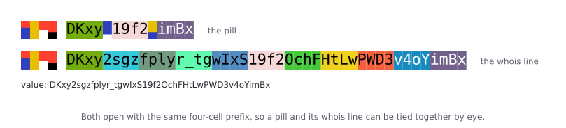
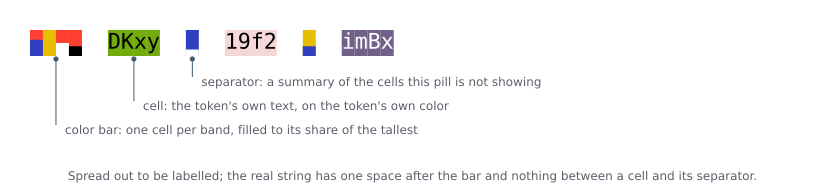
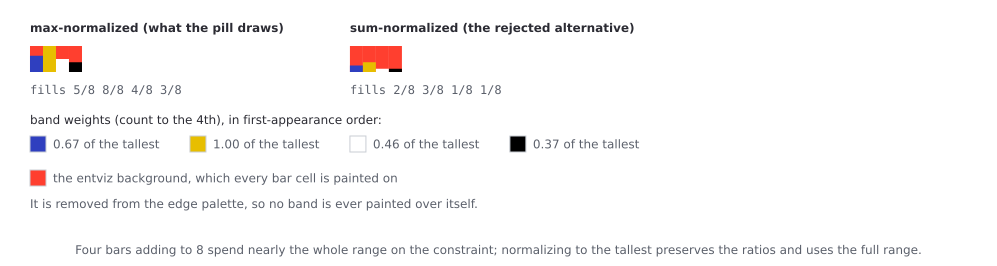
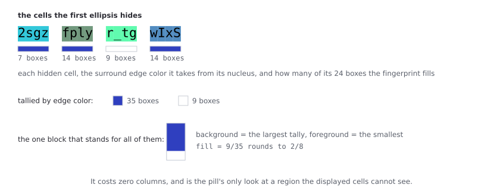
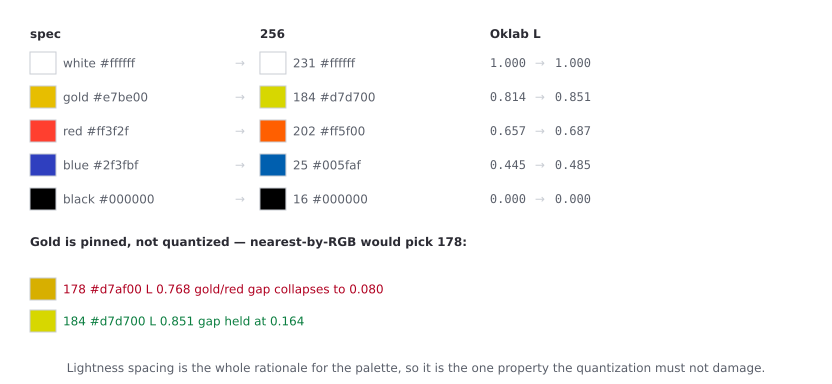
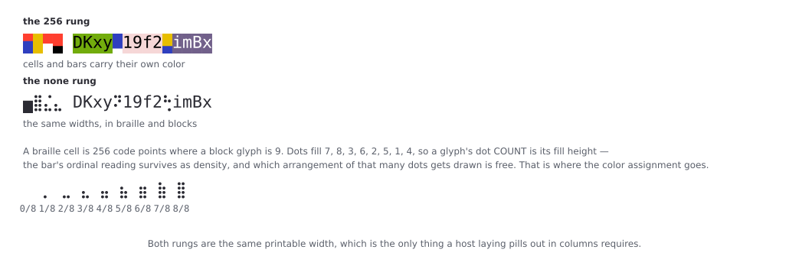
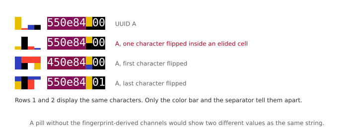

# The terminal pill

**Status:** implemented and shipped, in `src/entviz/terminal/`. **Audience:** maintainers of that subpackage, and hosts that consume it (first one: heti's TUI). **Normative status:** none. This is a design record, not spec text. The entviz spec (`docs/spec.md`) is untouched by anything here, there are no conformance obligations, and no port to `entviz-js` is implied. Where this document and the spec disagree about the entviz itself, the spec wins.

A **pill** is a one-line, static rendering of a value for a terminal: elided cell text, colored, about 19 columns wide. It is a sibling of the React `<EntvizPill>` (`entviz-js/packages/react/docs/pill-design.md`) but not a port of it — the React pill is interactive, expands, and carries copy affordances, and none of that exists here. A terminal pill is a string.

Every claim below was originally measured against the prototype `.ignored/pill-proto.py`, and has since been re-measured against the shipped `src/entviz/terminal/pill.py`, which reproduces all of it (§3.3's shape count and entropy, §3.4's separator entropy, §4.3's cap-6 fit rates) to within sampling noise.

---

## 1. What it is for

Recognition, not verification — the same seam the React pill draws (its §2). A pill answers "have I seen this one before, is this the one I meant?" It never answers "are these two the same?" A host that needs an equality decision routes to the full value or to a real entviz.

Two forms share one design:

- the **pill**, which elides most cells and fits in about 19 columns;
- the **whois line**, which shows every cell of the value on a line of its own, for selection and copying.

They open with the same four-cell prefix, deliberately, so a pill and its whois line can be tied together by eye.

For `DKxy2sgzfplyr_tgwIxS19f2OchFHtLwPWD3v4oYimBx`, the gallery's Ed25519 verification key:



**Figure 1.** The running example, painted. Every figure in this document is generated from a real `pill()` call by `scripts/pill_figures.py` and pinned by `tests/test_figures.py`, so none of them can drift from the code.

The glyphs alone, for a reader who wants the string rather than the picture:

```
▅█▄▃ DKxy▂19f2▃imBx                                    the pill
▅█▄▃ DKxy2sgzfplyr_tgwIxS19f2OchFHtLwPWD3v4oYimBx      the whois line
```

Do not read the color as decoration on top of that string. §3.1 is the argument that a cell's color and its characters are the same 24 bits written twice, and §5 is the case where two values produce *identical* glyph strings and are told apart by color alone — which is why this document is illustrated at all.

## 2. Terminal assumptions

Measured on the target terminal, 2026-08-15 (screenshot in the design session):

- **256 color is available; truecolor is not.** `SGR 48;2;r;g;b` renders as unstyled text. So the ladder has exactly two rungs, `256` and `none`. A 16-color rung is not worth building: every one of those slots is the user's theme and would render differently per terminal.
- **`SGR 58` (colored underline) is not available.** An earlier draft of the design put the color bar under the whois line as a colored underline; that is dead. Colored underlines are in general *less* portable than truecolor — they arrived with kitty around 2018 and spread to terminals that already had truecolor — so they are the wrong thing to reach for when truecolor is the thing you are missing.
- **Only palette indices 16–255 may be used.** Indices 0–15 are the user's theme and get remapped, so a pill that used them would render differently per terminal.

Capability detection is the **host's** job, not the pill's. The pill is a pure function of (value, options); `NO_COLOR`, `FORCE_COLOR` and `isatty` are decided by the host and expressed only as the color mode it asks for.

## 3. Anatomy



**Figure 2.** The same value as §1, spread out to be labelled. The real string has one space after the color bar and nothing between the cells and their separators — the pill spends no column on anything but that one space.

### 3.1 Cells

The pill shows the entviz's own cells, in reading order, with their own colors:

- **Text** is the cell's token text, exactly as the entviz renders it.
- **Background** is the cell's nucleus color — the token's 24-bit quant read straight out as RGB (`docs/spec.md:437`), quantized to 256.
- **Foreground** is white or black by the spec's Oklab rule (L < 0.6 → white, same line).

The color is not an extra channel. A 4-character base64url token is exactly 24 bits and an RGB triple is exactly 24 bits, so **a cell's color and its characters are the same number in two notations**. Quantizing to 256 strictly *loses* information relative to the text printed on top of it. Nothing is disclosed by the coloring that is not already on screen, and an attacker matching a cell's color has to match its characters.

This is why cells are shown **whole or not at all**. A cut mid-cell would show two characters of a four-character token while the color still encoded all twenty-four bits — the color would then be a coarse projection of characters deliberately withheld, which is the one thing this design avoids everywhere else. Cell alignment buys that invariant for the price of a column or two.

### 3.2 Which cells

The shape is the React pill's mnemonic, unchanged (`entviz-js/packages/core/src/describe.ts:428`):

- under 256 bits, or fewer than three non-blank cells → `first · last`
- at or above 256 bits → `first · middle · last`, where the middle prefers a real fingerprint-middle cell when the input has them (> 512 bits) and is otherwise the centre value cell.

**Width is not a caller-settable option.** It is a property of the value, like the entviz's own aspect ratio, and a host-settable width would make the same value render differently in two hosts. It falls out of the alphabet's cell size and the mnemonic shape. Measured across all 81 gallery values, whole pills run **11 to 24 columns** — 11 for the shortest base32, 14 for a UUID (hex cells, with a 2-character short final token), **19 for a CESR AID**, 24 for a large hex input, which is the ceiling. Constant within a type, never constant across types, so a host laying pills out in columns still needs the printable width reported to it.

`width` counts characters. The block glyphs and `…` are East Asian Width **Ambiguous**, so a terminal configured to render ambiguous characters double-width — some CJK setups — will disagree with it. Every ordinary Western configuration renders them narrow. If that ever bites, the fix is a host-side width function.

A **different** glyph set would also fix it, contrary to what this section claimed before 2026-08-20: the quadrant blocks (U+2596–U+259F) are EAW **Neutral**, and so is every braille pattern (U+2800–U+28FF). Quadrants are not worth a rewrite — 16 states with only partial ordinality against the eighths' 9 — but the braille fact is load-bearing for §4.3, where it means the `none` rung is *less* exposed to this than the `256` rung is.

Cells are read in token order, which equals the grid's reading order for non-blank cells because `assign_cell_indices` only *shifts* token indices to make room for blanks and never reorders them. This was an argument when the design was written; it is now pinned by `tests/terminal/test_terminal_pill.py:102`.

### 3.3 The color bar prefix

Four cells, one per band, in the entviz color bar's own first-appearance order (`docs/spec.md:513`). Each cell is a partial block glyph:

- **foreground** = the band's palette color, filling from the bottom;
- **background** = the *entviz* background color;
- **fill** = `round(8 · wᵢ / max(w))`, where `wᵢ` is that band's `count⁴` weight.

Background and fill can never collide, because the entviz background is removed from the edge palette (`docs/spec.md:417`), so no band is ever painted over itself. The worst pairing this can produce is gold-on-white, which is the palette's own designed-for minimum contrast. Using the background color here also puts its 2 bits on screen directly, instead of leaving them to be inferred from which of the five band letters is missing.

**Normalize to the tallest band, not to the sum.** Four bars adding to 8 spend almost the whole range on the constraint: band counts are multinomial over 256 slices, so they cluster at 64 ± 7 and the tallest bar is 3/8 about two-thirds of the time, never exceeding 4/8 in 98% of cases. Normalizing to the max preserves the ratios exactly while using the full range. Measured over 200,000 random digests:

| | distinct shapes | entropy | collision at n=6 |
|---|---|---|---|
| sum-normalized | 126 | 4.96 bits | 48.6% |
| truncate at 4, square, halve | 72 | 4.91 bits | 48.8% |
| **max-normalized** | **1836** | **10.25 bits** | **1.5%** |
| max-normalized, √ gamma | 1010 | 8.77 bits | 4.2% |



**Figure 3.** The same four band weights under both normalizations. Normalizing to the sum squashes the whole bar into the bottom two rungs; the ratios are identical and only the range differs.

The middle row is worth keeping as a warning: a monotone transform applied *after* quantization cannot recover a distinction quantization already destroyed, and truncating merges the rare tall bars, so it ends up worse than doing nothing. The fix had to move upstream to the normalization.

The four cells sit side by side rather than stacked, so unlike the SVG's single stacked bar there is no total to conserve, and max-normalization is arguably the more honest encoding as well as the more legible one.

### 3.4 The separators

Where the React pill writes `…`, the terminal pill writes one block glyph carrying a summary of **the cells that ellipsis is hiding**:

1. For each elided cell in that gap, take its **surround edge color** — the nearest edge-palette entry to its nucleus by the spec's weighted RGB metric (`docs/spec.md:443`) — and the number of its 24 surround boxes that are filled (the popcount of the ftok quant's low 24 bits, `docs/spec.md:462`).

   The v10 fingerprint-edge override on grid position 0 and the two quartile cells (`docs/spec.md:451`) is deliberately **not** applied. Honoring it would drag grid geometry into a channel that otherwise needs none, and it can only add entropy, so skipping it makes the measurements below floors rather than flattering them. This is a place where the pill knowingly diverges from what the SVG draws; it is a summary channel, not a rendering of the entviz.
2. Tally filled boxes per edge color across the gap.
3. **Background** = the color with the largest tally, **foreground** = the color with the smallest, ties broken by palette order.
4. **Fill** = `round(8 · least / greatest)`.

Colors that no cell in the gap uses are not candidates — otherwise every gap would nominate an unused color as its rarest and the fill would always be zero. Ties break by palette order. A gap where the rarest *present* color contributes no filled boxes has a fill of zero, and since the background is painted, that renders as an honest solid block of the dominant color.

Measured over 220,000 gaps (three samples of random AIDs, two gaps each) the fill spreads across 1/8 to 8/8 with a mode at 3/8 (~31%) and a second lobe at 2/8 (~14%) and 4/8 (~21%). The extremes are rare but real: 1/8 lands in ~0.65% of gaps, and the solid 0/8 case occurred once in 220,000 — so it is reachable rather than merely theoretical, which an earlier draft measured as a floor of 2/8 on a smaller sample.

Worth 12.55 bits, near-independent of the prefix — the edge color comes from the nucleus, the box count from the ftok. The prefix measures at ≥ 15.35 bits over the same sample (heights *and* band colors, not the 10.25 of §3.3 which is heights alone); that is a floor, since 45,527 of 60,000 draws were distinct and the sample censors the tail. The combined channel could not be resolved at all — 59,980 distinct in 60,000 — but if the two are independent it is around 27 bits.



**Figure 4.** The first gap of the running example, end to end: the four hidden cells, the edge color each takes from its own nucleus, the filled-box counts the fingerprint gives them, the tally, and the single block that results.

**`…` survives, with a narrowed meaning.** The block glyph means "cells you are not being shown," so it needs cells to summarize. Where there are none, the pill falls back to a literal `…` (`NO_CELLS`), which means the different thing: "characters that became no cell at all." That is the >512-bit case, where the tokenizer only ever produced head, fingerprint-middle and tail cells and the material between them was never tokenized — so the whois line, which otherwise shows every cell, carries two of these. A pill gap that turns out to be empty takes the same marker for the same reason.

**It costs zero columns**, which is what earns it a place. On recognition grounds alone it is redundant: the prefix by itself already puts a six-pill collision at one window in 2,500, and 27 bits versus 15 is the difference between never and never. What it adds is a second, independent, *localized* look at the elided region — the part of the value no entropy-derived channel in the pill can otherwise see.

## 4. Color

### 4.1 The palette is a table, not a quantization

The spec palette is five fixed colors, so the 256-color rendering of it is a five-entry lookup, chosen once by hand:

| | spec | Oklab L | 256 | | Oklab L |
|---|---|---|---|---|---|
| white | `#ffffff` | 1.000 | 231 | `#ffffff` | 1.000 |
| gold | `#e7be00` | 0.814 | 184 | `#d7d700` | 0.851 |
| red | `#ff3f2f` | 0.657 | 202 | `#ff5f00` | 0.687 |
| blue | `#2f3fbf` | 0.445 | 25 | `#005faf` | 0.485 |
| black | `#000000` | 0.000 | 16 | `#000000` | 0.000 |



**Figure 5.** The same table as swatches, with the rejected gold below it. A table of hex codes cannot show that 178 is a duller, darker mustard while 184 stays a bright yellow — which is the entire reason for the pin.

These are **not** the nearest entries by RGB distance. Nearest picks 178 (`#d7af00`) for gold, which darkens it while the quantizer simultaneously lightens red, collapsing the gold/red lightness gap to 0.080 — half the spec palette's own worst adjacent gap of 0.157. Since lightness spacing is the whole rationale for the palette (`docs/spec.md:411`), that is the one property the quantization must not damage. Picking 184 (`#d7d700`) instead maximizes the minimum adjacent gap at **0.149**, level with the spec palette. Gold becomes a more yellow gold, which if anything strengthens the hue cue against red.

### 4.2 Everything else

Nucleus colors are arbitrary RGB and do need a quantizer: nearest entry in the 6×6×6 cube plus the 24 grays, by the spec's own weighted RGB metric (`docs/spec.md:443`), so the snapping rule is one the spec already defines. Never indices 0–15.

Every visible cell sets **both** foreground and background, so nothing inherits the terminal's theme and the pill renders identically on light and dark. This is load-bearing rather than incidental: the palette is spaced across the full lightness range on purpose, so palette colors used as *foreground* on an unknown background would put white text on light terminals and black on dark ones. Paint characters **on** their color, never **in** it.

### 4.3 The `none` rung

Stripping color costs the prefix about 5 bits — which band is which color, and which palette entry the background is — and costs each separator about 4, since `_separator_span` puts nearly everything in its foreground/background pair and leaves only a 9-level fill behind. Two earlier candidates each recovered half of that: block glyphs keep the heights and lose the identities, while four painted band letters (`wgrb`) keep the identities and lose the heights.

Braille recovers both, because a braille cell is 256 code points where a block glyph is 9. The `none` rung therefore substitutes glyphs rather than merely dropping escapes — spans carry a `mono` alternate, and `ansi` prints it. Both rungs stay the same printable width, which is the only thing a host laying out columns requires, and it is fixed before the color mode is known.

Bear in mind who reaches this rung. It is largely the **piped** case, where the consumer is a machine that should be handed the value rather than a pill; and where the consumer is a person running a screen reader, the same answer applies for a different reason. A pill affords *glancing*, which is not what a screen reader does, so a host that knows it is talking to one should print the value. That decision belongs to the host, like every other capability question (§2). No glyph set changes it: both rungs announce as symbol names or are skipped entirely at normal verbosity. On a refreshable braille display the substitution should if anything help, since U+2800–U+28FF is the block that exists to carry dot patterns and passes through to the cells as itself — but that claim has not been checked against a real BRLTTY stack, and it is not a reason to render a pill at somebody rather than the value.

**The prefix keeps a readable bar.** Dots fill width-first from the bottom — dots 7, 8, 3, 6, 2, 5, 1, 4 — so a glyph's dot *count* equals its fill height and the ordinal reading survives as density:

```
  ⠀ ⡀ ⣀ ⣄ ⣤ ⣦ ⣶ ⣷ ⣿      0/8 through 8/8
```



**Figure 6.** The same pill on both rungs, with the density ramp below. The color the top row carries is exactly what the bottom row has to recover in its choice of dot arrangement.

Which *arrangement* of that many dots gets drawn is then free, and that is where the color assignment goes: which of the 5 palette colors is the background, times the 4! orders the bands take over the rest, is 120 states. It is written across the four cells jointly in mixed radix rather than each cell naming its own color — a cell alone would need 5 codes, and the two extreme heights have only one arrangement each. Nothing decodes a pill by eye, so locality costs nothing.

Only the **6 bottom-heaviest** arrangements per height are used. Lexicographic order over the dot list happens to rank them that way, so the cap costs one constant and keeps every glyph reading as a bar rather than as scattered dots:

```
  h=1  ⡀ ⢀ ⠄ ⠠ ⠂ ⠐        h=5  ⣦ ⣴ ⣥ ⣬ ⣖ ⣇
  h=3  ⣄ ⣠ ⣂ ⣐ ⣁ ⣈        h=7  ⣷ ⣾ ⣯ ⣽ ⣟ ⣻
```

Measured over 100,000 random digests, the full 120-state assignment fits in **98.0%** of draws at a cap of 6, against 82.2% at 4 and 99.4% uncapped. Six is the knee. When it does not fit — three or more bands at an extreme height, where each cell offers only two codes — the encoder names the background color alone and drops the order. That shortfall is a function of the heights, which both ends can see, so it needs no escape mark; and four two-code cells still give 16, so the background always fits.

The block glyph stays in the alphabet as the last code at every height. That is what makes the extreme heights non-degenerate, and it is why a `none`-rung prefix mixes families — `▅█⣭⣶`, `▄⡐█⣶`. Both halves are doing work: the dot count (or the block's own level) carries the height, the choice of family carries a bit.

**The separator goes the other way and becomes opaque.** One cell cannot hold this channel positionally: an ordered palette pair is 20 states on its own, so nothing readable is left for the ratio. Since the separator is already a summary nobody decodes rather than a magnitude anyone reads, the ratio's legibility is the cheaper thing to spend. Pair and fill go in as one number, reaching 225 of the 256 patterns.

The remaining 31 stay unused **deliberately**. There is spare room to widen the fill quantization or to fold in the per-color tallies the gap currently discards, and taking it would mean the `none` rung said *more* about a value than the `256` rung does — so that stripping color gained you entropy. The ladder must not invert. Both rungs summarize the same thing; only the presentation differs.

## 5. Security notes

| Decision | Why |
|---|---|
| Pill affords recognition only | A glance is never sufficient for equality (paper §2.3, §5.1) |
| Cells shown whole or not at all | Keeps a cell's color derivable from its own displayed characters |
| No short head+tail teaser outside cell alignment | Prefix/suffix grinding (threat model T1/T6) |
| Prefix and separators disclose elided cells | Deliberate, and the only coverage the pill has for what the ellipsis hides. Both are lossy summaries; matching either is far cheaper than matching the value, which is acceptable precisely because the pill is not a verification surface |
| Never locale-transform the value; locale-invariant casing only | Turkish dotless-`i` corrupts normalization and the fingerprint |
| Unrecognized input raises, never renders | `render()` falls back to base64-encoding arbitrary text, which is right for a visualization and wrong here: a mistyped identifier in a TUI must not come back looking like a well-formed one |

The near-neighbour case is what makes the prefix and separators load-bearing rather than decorative. Two values differing in a single character *inside an elided cell* produce an identical mnemonic and identical nucleus colors — the gallery's `--section avalanche` pairs demonstrate exactly this, with "UUID A" and "UUID A with mid char flipped" both rendering `550e84…00`. Only the fingerprint-derived channels separate them. A pill without them would show two different values as the same string.



**Figure 7.** The avalanche quartet. Rows 1 and 2 are the case this section is about: identical glyphs, identical nucleus colors, told apart only by the color bar and the separator.

The other case worth knowing about: `BKxy2sgz…` and `DKxy2sgz…`, the same body under a non-transferable versus a transferable derivation code, differ in cell 0's quant only in the blue byte (`#72ac04` vs `#72ac0c`) — invisible in truecolor and quantizing to the same 256 index. Their pills are distinguished by the literal `B` vs `D` and by the prefix, not by color.

## 6. Where the code lives

`src/entviz/terminal/`, a subpackage of the same distribution, never imported by the base package — `from entviz.terminal import pill, whois, ansi`. Tests in `tests/terminal/`.

It is **not** an optional extra. Extras gate *dependencies*, and this has none: the pill reaches only `entropy`, `fingerprint`, `colors` and `characterize`, and `lxml` is reachable only through `pipeline`, `renderer` and `shapes`. So the pill's dependency set is already lxml-free. An extra that installs nothing would just mislead.

Being in the same distribution means it inherits a version number whose MINOR component, by this project's convention, means "the spec's major version" (`src/entviz/__init__.py:14`). Nothing here is spec-bound, so that number says nothing about this subpackage — the `__init__` docstring says so out loud. If the API ever needs a breaking change, the convention has no room for it and that is the moment to split a second distribution out of this repo. It cannot be `entviz.terminal` at that point: `src/entviz/__init__.py` makes `entviz` a regular package, so two distributions cannot both write into it, and the import would become `entviz_terminal`. heti already wraps the call behind a single `render_pill()` for exactly this reason, so the rename costs one line there.

`pill(value)` and `whois(value)` each return a `Pill` — `spans`, `plain`, and `width` — and `ansi(rendered, color=...)` serializes one. A `Span` carries its `text`, a `channel` (`BAR`, `CELL`, `SEPARATOR`, `GAP`), its `fg`/`bg` as spec sRGB rather than palette indices, and its `mono` alternate. Splitting rendering from serialization is what lets a host lay out columns without stripping escape codes, and lets a caller measure a pill without rendering one. `EIGHTHS`, `BAR_ALPHABET` and `NO_CELLS` are exported for hosts that restyle or measure the glyphs directly.

The API is otherwise smaller than the seam contract proposed. There are no channel flags: trust posture is the host's to decide, and a host that doesn't want value-derived channels shown doesn't call `pill()`. That keeps the policy in the one place that knows the value's provenance, which is what the contract asked for anyway — it just doesn't need flags to express it.

## 7. Open

- `comparison_text()` (cells in reading order, space-separated, case-exact) is in the seam contract and is not built.
- No CLI. The `entviz` console script emits spec-bound SVG; putting a non-normative pill behind the same command would blur exactly the line this document draws. A separate script is the likelier answer if one is wanted.
